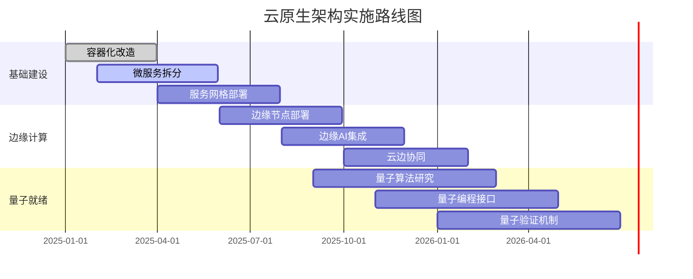

# 云原生架构理论框架 - 2025版

[返回主题树](./00-主题树与内容索引.md)

> **重要声明**：本框架基于2025年最新云原生技术发展趋势，为形式化架构理论项目提供云原生架构的完整理论框架，确保架构设计与现代云原生技术栈的深度融合。

## 目录

- [1. 云原生架构概述](#1-云原生架构概述)
- [2. 核心理论框架](#2-核心理论框架)
- [3. 技术架构设计](#3-技术架构设计)
- [4. 实施指导原则](#4-实施指导原则)
- [5. 质量保证体系](#5-质量保证体系)
- [6. 标准对齐](#6-标准对齐)
- [7. 最佳实践](#7-最佳实践)
- [8. 实施检查清单](#8-实施检查清单)

## 1. 云原生架构概述

### 1.1 云原生架构定义

**定义 1.1** (云原生架构)
云原生架构是一种基于云平台、容器化、微服务、DevOps等技术构建的现代化软件架构模式，具有高可用、可扩展、可维护、可观测等特性。

$$CloudNativeArchitecture = \langle C, M, S, D, O, A \rangle$$

其中：

- $C$：容器化（Containerization）
- $M$：微服务（Microservices）
- $S$：服务网格（Service Mesh）
- $D$：DevOps（Development Operations）
- $O$：可观测性（Observability）
- $A$：自动化（Automation）

### 1.2 核心特征

**特征 1.1** (云原生核心特征)

- **容器化**：应用打包在容器中，实现环境一致性
- **微服务**：应用拆分为小型、独立的服务
- **服务网格**：服务间通信的透明化基础设施
- **DevOps**：开发与运维的深度融合
- **可观测性**：全面的监控、日志、追踪
- **自动化**：自动化的部署、扩展、恢复

**特征 1.2** (架构优势)

- **高可用性**：通过冗余和故障转移实现高可用
- **可扩展性**：支持水平和垂直扩展
- **可维护性**：模块化设计便于维护
- **可移植性**：跨云平台部署
- **成本效益**：按需使用资源
- **快速交付**：支持快速迭代和部署

### 1.3 技术栈

**技术栈 1.1** (容器化技术)

- **Docker**：容器运行时和镜像构建
- **Kubernetes**：容器编排和管理
- **Podman**：无守护进程容器运行时
- **containerd**：容器运行时接口

**技术栈 1.2** (微服务技术)

- **Spring Boot**：Java微服务框架
- **Node.js**：JavaScript微服务框架
- **Go**：高性能微服务开发
- **Rust**：内存安全微服务开发

**技术栈 1.3** (服务网格技术)

- **Istio**：服务网格数据平面和控制平面
- **Linkerd**：轻量级服务网格
- **Consul Connect**：服务发现和连接
- **Envoy**：高性能代理

## 2. 核心理论框架

### 2.1 架构层次理论

**理论 2.1** (云原生架构层次)
云原生架构采用分层设计，每层都有明确的职责和接口：

```text
云原生架构层次
├── 应用层 (Application Layer)
│   ├── 业务服务
│   ├── 数据服务
│   └── 集成服务
├── 服务层 (Service Layer)
│   ├── 微服务
│   ├── API网关
│   └── 服务发现
├── 平台层 (Platform Layer)
│   ├── 容器编排
│   ├── 服务网格
│   └── 配置管理
├── 基础设施层 (Infrastructure Layer)
│   ├── 容器运行时
│   ├── 网络
│   └── 存储
└── 云平台层 (Cloud Platform Layer)
    ├── 计算资源
    ├── 网络资源
    └── 存储资源
```

**理论 2.2** (层次依赖关系)

- **应用层** → **服务层**：应用依赖服务
- **服务层** → **平台层**：服务依赖平台
- **平台层** → **基础设施层**：平台依赖基础设施
- **基础设施层** → **云平台层**：基础设施依赖云平台

### 2.2 微服务理论

**理论 2.3** (微服务设计原则)

- **单一职责**：每个服务只负责一个业务功能
- **自治性**：服务独立开发、部署、扩展
- **去中心化**：无中心化的数据管理
- **容错性**：服务故障不影响整体系统
- **可观测性**：服务状态可监控和追踪

**理论 2.4** (微服务边界划分)

- **业务边界**：按业务领域划分服务边界
- **数据边界**：每个服务拥有独立的数据存储
- **技术边界**：服务可以使用不同的技术栈
- **团队边界**：按团队组织划分服务边界

### 2.3 容器化理论

**理论 2.5** (容器化设计原则)

- **不可变性**：容器镜像不可变
- **无状态性**：容器内应用无状态
- **可移植性**：容器可在不同环境运行
- **资源隔离**：容器间资源隔离
- **快速启动**：容器快速启动和停止

**理论 2.6** (容器编排理论)

- **声明式配置**：使用声明式配置描述期望状态
- **自动调度**：自动调度容器到合适节点
- **自动扩展**：根据负载自动扩展容器
- **自动恢复**：自动检测和恢复故障容器
- **滚动更新**：支持零停机滚动更新

### 2.4 服务网格理论

**理论 2.7** (服务网格架构)
服务网格由数据平面和控制平面组成：

- **数据平面**：
  - 代理服务：处理服务间通信
  - 流量管理：路由、负载均衡、熔断
  - 安全通信：TLS加密、身份认证
  - 可观测性：指标收集、日志记录

- **控制平面**：
  - 配置管理：管理代理配置
  - 服务发现：发现和注册服务
  - 策略执行：执行安全和服务策略
  - 监控管理：监控网格状态

**理论 2.8** (服务网格优势)

- **透明性**：对应用透明的网络功能
- **统一性**：统一的网络策略和配置
- **可观测性**：全面的网络可观测性
- **安全性**：内置的安全功能
- **可扩展性**：支持大规模服务部署

## 3. 技术架构设计

### 3.1 整体架构设计

**设计 3.1** (云原生整体架构)

```text
云原生整体架构
├── 前端层
│   ├── Web应用
│   ├── 移动应用
│   └── API客户端
├── 网关层
│   ├── API网关
│   ├── 负载均衡器
│   └── 反向代理
├── 服务层
│   ├── 业务微服务
│   ├── 数据微服务
│   └── 集成微服务
├── 数据层
│   ├── 关系数据库
│   ├── NoSQL数据库
│   └── 缓存系统
├── 消息层
│   ├── 消息队列
│   ├── 事件总线
│   └── 流处理
├── 基础设施层
│   ├── Kubernetes集群
│   ├── 服务网格
│   └── 监控系统
└── 云平台层
    ├── 计算服务
    ├── 网络服务
    └── 存储服务
```

### 3.2 微服务架构设计

**设计 3.2** (微服务架构模式)

```text
微服务架构模式
├── 领域驱动设计 (DDD)
│   ├── 限界上下文
│   ├── 聚合根
│   ├── 实体
│   └── 值对象
├── 服务拆分策略
│   ├── 按业务能力拆分
│   ├── 按数据拆分
│   ├── 按团队拆分
│   └── 按技术拆分
├── 服务通信模式
│   ├── 同步通信
│   ├── 异步通信
│   ├── 事件驱动
│   └── 消息传递
└── 数据管理策略
    ├── 数据库 per 服务
    ├── 共享数据库
    ├── 事件溯源
    └── CQRS
```

### 3.3 容器化架构设计

**设计 3.3** (容器化架构)

```text
容器化架构
├── 容器镜像
│   ├── 基础镜像
│   ├── 运行时镜像
│   ├── 应用镜像
│   └── 多阶段构建
├── 容器编排
│   ├── Pod管理
│   ├── 服务管理
│   ├── 配置管理
│   └── 存储管理
├── 网络设计
│   ├── Pod网络
│   ├── 服务网络
│   ├── 入口网络
│   └── 出口网络
└── 存储设计
    ├── 临时存储
    ├── 持久存储
    ├── 配置存储
    └── 密钥存储
```

### 3.4 服务网格架构设计

**设计 3.4** (服务网格架构)

```text
服务网格架构
├── 数据平面
│   ├── Envoy代理
│   ├── 流量管理
│   ├── 安全通信
│   └── 可观测性
├── 控制平面
│   ├── Istio Pilot
│   ├── Istio Citadel
│   ├── Istio Galley
│   └── Istio Telemetry
├── 配置管理
│   ├── 虚拟服务
│   ├── 目标规则
│   ├── 网关配置
│   └── 安全策略
└── 监控和追踪
    ├── 指标收集
    ├── 日志聚合
    ├── 分布式追踪
    └── 告警管理
```

## 4. 实施指导原则

### 4.1 设计原则

**原则 4.1** (云原生设计原则)

- **12-Factor App**：遵循12要素应用原则
- **API-First**：API优先设计
- **微服务优先**：优先采用微服务架构
- **容器优先**：优先使用容器化部署
- **自动化优先**：优先实现自动化

**原则 4.2** (架构设计原则)

- **高内聚低耦合**：服务内部高内聚，服务间低耦合
- **故障隔离**：服务故障不影响其他服务
- **数据一致性**：保证数据的最终一致性
- **性能优化**：优化系统性能
- **安全优先**：安全是设计的重要考虑

### 4.2 实施策略

**策略 4.1** (渐进式迁移)

- **评估现状**：评估现有系统架构
- **制定计划**：制定迁移计划
- **选择试点**：选择合适的功能作为试点
- **逐步迁移**：逐步迁移到云原生架构
- **持续优化**：持续优化和改进

**策略 4.2** (技术选型策略)

- **成熟度优先**：优先选择成熟的技术
- **社区活跃度**：考虑技术社区活跃度
- **学习成本**：考虑团队学习成本
- **集成难度**：考虑技术集成难度
- **长期支持**：考虑长期技术支持

### 4.3 团队组织

**组织 4.1** (团队结构)

- **平台团队**：负责云原生平台建设
- **服务团队**：负责微服务开发
- **运维团队**：负责系统运维
- **质量团队**：负责质量保证
- **安全团队**：负责安全防护

**组织 4.2** (协作模式)

- **DevOps文化**：建立DevOps文化
- **跨职能团队**：组建跨职能团队
- **持续沟通**：建立持续沟通机制
- **知识共享**：促进知识共享
- **持续学习**：鼓励持续学习

## 5. 质量保证体系

### 5.1 架构质量

**质量 5.1** (架构质量指标)

- **可用性**：系统可用性≥99.9%
- **可扩展性**：支持水平扩展≥10倍
- **性能**：响应时间≤100ms
- **安全性**：通过安全审计
- **可维护性**：代码复杂度≤10

**质量 5.2** (架构评估)

- **架构评审**：定期进行架构评审
- **技术债务**：管理技术债务
- **性能测试**：定期进行性能测试
- **安全测试**：定期进行安全测试
- **可观测性**：建立可观测性体系

### 5.2 服务质量

**质量 5.3** (服务质量指标)

- **服务可用性**：服务可用性≥99.5%
- **响应时间**：服务响应时间≤200ms
- **错误率**：服务错误率≤0.1%
- **吞吐量**：服务吞吐量≥1000TPS
- **延迟**：服务延迟≤50ms

**质量 5.4** (服务监控)

- **健康检查**：定期健康检查
- **性能监控**：实时性能监控
- **错误监控**：错误监控和告警
- **容量监控**：容量使用监控
- **依赖监控**：依赖服务监控

### 5.3 数据质量

**质量 5.5** (数据质量指标)

- **数据准确性**：数据准确性≥99.9%
- **数据完整性**：数据完整性≥99.9%
- **数据一致性**：数据一致性≥99.9%
- **数据时效性**：数据时效性≤1秒
- **数据可用性**：数据可用性≥99.9%

**质量 5.6** (数据管理)

- **数据备份**：定期数据备份
- **数据恢复**：快速数据恢复
- **数据迁移**：安全数据迁移
- **数据清理**：定期数据清理
- **数据安全**：数据安全保护

## 6. 标准对齐

### 6.1 ISO/IEC标准对齐

**对齐 6.1** (ISO/IEC 25010:2025对齐)

- **功能适合性**：
  - 功能完整性：云原生功能完整性
  - 功能正确性：微服务功能正确性
  - 功能适当性：容器化功能适当性

- **性能效率**：
  - 时间行为：服务响应时间优化
  - 资源利用：资源利用率优化
  - 容量：系统容量扩展

- **兼容性**：
  - 互操作性：服务间互操作性
  - 共存性：多服务共存
  - 可移植性：跨云平台移植

### 6.2 IEEE标准对齐

**对齐 6.2** (IEEE 1012:2025对齐)

- **验证计划**：云原生验证计划
- **验证活动**：微服务验证活动
- **验证报告**：容器化验证报告
- **验证工具**：服务网格验证工具

### 6.3 行业标准对齐

**对齐 6.3** (CNCF标准对齐)

- **Kubernetes**：容器编排标准
- **Istio**：服务网格标准
- **Prometheus**：监控标准
- **Jaeger**：追踪标准
- **Fluentd**：日志标准

## 7. 最佳实践

### 7.1 微服务最佳实践

**实践 7.1** (微服务设计)

- **服务边界**：清晰的服务边界定义
- **API设计**：RESTful API设计
- **数据管理**：数据库per服务
- **错误处理**：统一的错误处理
- **版本管理**：API版本管理

**实践 7.2** (微服务开发)

- **代码质量**：高代码质量标准
- **测试策略**：全面的测试策略
- **文档管理**：完善的文档管理
- **代码审查**：严格的代码审查
- **持续集成**：自动化持续集成

### 7.2 容器化最佳实践

**实践 7.3** (容器设计)

- **镜像优化**：最小化镜像大小
- **安全扫描**：定期安全扫描
- **多阶段构建**：使用多阶段构建
- **非root用户**：使用非root用户
- **健康检查**：配置健康检查

**实践 7.4** (容器编排)

- **资源配置**：合理的资源配置
- **调度策略**：优化的调度策略
- **滚动更新**：零停机滚动更新
- **自动扩展**：基于指标的自动扩展
- **故障恢复**：自动故障恢复

### 7.3 服务网格最佳实践

**实践 7.5** (服务网格配置)

- **流量管理**：智能流量管理
- **安全策略**：严格的安全策略
- **监控配置**：全面的监控配置
- **性能优化**：网络性能优化
- **故障处理**：优雅的故障处理

### 7.4 可观测性最佳实践

**实践 7.6** (监控和日志)

- **指标收集**：全面的指标收集
- **日志聚合**：集中式日志聚合
- **分布式追踪**：端到端追踪
- **告警管理**：智能告警管理
- **仪表板**：实时监控仪表板

## 8. 实施检查清单

### 8.1 架构设计检查清单

**检查清单 8.1** (架构设计)

- [ ] 云原生架构设计完成
- [ ] 微服务边界划分完成
- [ ] 容器化方案设计完成
- [ ] 服务网格配置完成
- [ ] 数据架构设计完成
- [ ] 网络架构设计完成
- [ ] 安全架构设计完成
- [ ] 监控架构设计完成

### 8.2 技术选型检查清单

**检查清单 8.2** (技术选型)

- [ ] 容器技术选型完成
- [ ] 编排技术选型完成
- [ ] 微服务框架选型完成
- [ ] 数据库技术选型完成
- [ ] 消息队列选型完成
- [ ] 监控工具选型完成
- [ ] 日志工具选型完成
- [ ] 追踪工具选型完成

### 8.3 开发实施检查清单

**检查清单 8.3** (开发实施)

- [ ] 开发环境搭建完成
- [ ] CI/CD流水线建立完成
- [ ] 微服务开发完成
- [ ] 容器镜像构建完成
- [ ] 服务部署配置完成
- [ ] 监控配置完成
- [ ] 日志配置完成
- [ ] 安全配置完成

### 8.4 测试验证检查清单

**检查清单 8.4** (测试验证)

- [ ] 单元测试完成
- [ ] 集成测试完成
- [ ] 性能测试完成
- [ ] 安全测试完成
- [ ] 可用性测试完成
- [ ] 压力测试完成
- [ ] 故障测试完成
- [ ] 用户验收测试完成

### 8.5 运维管理检查清单

**检查清单 8.5** (运维管理)

- [ ] 监控系统部署完成
- [ ] 告警系统配置完成
- [ ] 日志系统部署完成
- [ ] 备份策略实施完成
- [ ] 灾难恢复计划完成
- [ ] 安全防护部署完成
- [ ] 性能优化完成
- [ ] 运维文档编写完成

## 9. 结论

云原生架构理论框架为形式化架构理论项目提供了完整的云原生架构指导。通过系统性的理论框架、技术架构、实施原则和最佳实践，可以确保项目采用现代化的云原生架构，实现高可用、可扩展、可维护的系统。

**关键价值**：

1. **现代化架构**：采用最新的云原生技术栈
2. **高可用性**：通过冗余和故障转移实现高可用
3. **可扩展性**：支持水平和垂直扩展
4. **可维护性**：模块化设计便于维护
5. **成本效益**：按需使用资源，降低成本

**预期成果**：

- 系统可用性达到99.9%以上
- 支持水平扩展10倍以上
- 响应时间控制在100ms以内
- 实现零停机部署
- 建立全面的可观测性

**实施建议**：

1. **渐进式迁移**：采用渐进式迁移策略
2. **团队培训**：加强团队云原生技术培训
3. **工具链建设**：建立完整的工具链
4. **文化转变**：建立DevOps文化
5. **持续改进**：持续优化和改进架构

通过实施本框架，项目将成功采用云原生架构，为形式化架构理论的发展提供强有力的技术支撑。

## 9. 边缘计算架构理论

### 9.1 边缘计算概述

**定义 9.1** (边缘计算架构)
边缘计算是一种将计算、存储和网络资源部署在靠近数据源和用户的边缘节点上的分布式计算架构，具有低延迟、高带宽、本地处理等特性。

$$EdgeComputingArchitecture = \langle E, C, N, S, A, I \rangle$$

其中：

- $E$：边缘节点（Edge Nodes）
- $C$：边缘计算（Edge Computing）
- $N$：边缘网络（Edge Network）
- $S$：边缘存储（Edge Storage）
- $A$：边缘应用（Edge Applications）
- $I$：边缘智能（Edge Intelligence）

### 9.2 边缘计算架构层次

**架构 9.1** (边缘计算层次架构)

```text
边缘计算层次架构
├── 边缘应用层 (Edge Application Layer)
│   ├── 实时应用
│   ├── 智能应用
│   └── 本地应用
├── 边缘服务层 (Edge Service Layer)
│   ├── 边缘微服务
│   ├── 边缘API网关
│   └── 边缘服务发现
├── 边缘平台层 (Edge Platform Layer)
│   ├── 边缘容器编排
│   ├── 边缘服务网格
│   └── 边缘配置管理
├── 边缘基础设施层 (Edge Infrastructure Layer)
│   ├── 边缘计算节点
│   ├── 边缘网络
│   └── 边缘存储
└── 云边协同层 (Cloud-Edge Collaboration Layer)
    ├── 云边数据同步
    ├── 云边任务调度
    └── 云边资源管理
```

### 9.3 边缘计算技术栈

**技术栈 9.1** (边缘计算技术)

- **边缘容器化**：
  - K3s：轻量级Kubernetes
  - k0s：零依赖Kubernetes
  - MicroK8s：单节点Kubernetes
  - EdgeX Foundry：边缘计算平台

- **边缘AI**：
  - TensorFlow Lite：移动端AI推理
  - ONNX Runtime：跨平台AI推理
  - OpenVINO：Intel边缘AI
  - NVIDIA Jetson：边缘AI硬件

- **边缘网络**：
  - 5G网络：高速低延迟网络
  - MEC：移动边缘计算
  - SD-WAN：软件定义广域网
  - Edge VPN：边缘虚拟专用网

### 9.4 边缘计算设计原则

**原则 9.1** (边缘计算设计原则)

- **就近处理**：数据就近处理，减少网络传输
- **低延迟**：优化延迟，满足实时性要求
- **高可用**：边缘节点高可用，保证服务连续性
- **智能调度**：智能调度任务到合适的边缘节点
- **云边协同**：云边协同，实现资源优化配置

## 10. 量子就绪架构理论

### 10.1 量子就绪架构概述

**定义 10.1** (量子就绪架构)
量子就绪架构是一种为量子计算时代做好准备的架构设计，具有量子算法支持、量子编程接口、量子验证机制等特性。

$$QuantumReadyArchitecture = \langle Q, A, P, V, S, I \rangle$$

其中：

- $Q$：量子算法（Quantum Algorithms）
- $A$：量子应用（Quantum Applications）
- $P$：量子编程（Quantum Programming）
- $V$：量子验证（Quantum Verification）
- $S$：量子模拟（Quantum Simulation）
- $I$：量子接口（Quantum Interface）

### 10.2 量子就绪架构层次

**架构 10.1** (量子就绪层次架构)

```text
量子就绪层次架构
├── 量子应用层 (Quantum Application Layer)
│   ├── 量子机器学习
│   ├── 量子优化
│   └── 量子密码学
├── 量子算法层 (Quantum Algorithm Layer)
│   ├── 量子搜索算法
│   ├── 量子优化算法
│   └── 量子机器学习算法
├── 量子编程层 (Quantum Programming Layer)
│   ├── Q#编程语言
│   ├── Qiskit框架
│   └── Cirq框架
├── 量子模拟层 (Quantum Simulation Layer)
│   ├── 量子电路模拟
│   ├── 量子态模拟
│   └── 量子噪声模拟
└── 量子硬件层 (Quantum Hardware Layer)
    ├── 量子处理器
    ├── 量子存储器
    └── 量子通信
```

### 10.3 量子就绪技术栈

**技术栈 10.1** (量子就绪技术)

- **量子编程语言**：
  - Q#：微软量子编程语言
  - Qiskit：IBM量子计算框架
  - Cirq：Google量子计算框架
  - PennyLane：量子机器学习框架

- **量子模拟器**：
  - Qiskit Aer：IBM量子模拟器
  - Cirq Simulator：Google量子模拟器
  - Q# Simulator：微软量子模拟器
  - PennyLane Simulator：量子机器学习模拟器

- **量子硬件**：
  - IBM Quantum：IBM量子计算机
  - Google Quantum：Google量子计算机
  - IonQ：离子阱量子计算机
  - Rigetti：超导量子计算机

### 10.4 量子就绪设计原则

**原则 10.1** (量子就绪设计原则)

- **量子优势**：利用量子计算优势解决经典计算难题
- **混合计算**：量子计算与经典计算混合使用
- **容错设计**：设计容错的量子算法和系统
- **可扩展性**：支持量子比特数量的扩展
- **标准化**：遵循量子计算标准和规范

## 11. 云边量子一体化架构

### 11.1 一体化架构设计

**设计 11.1** (云边量子一体化架构)

```text
云边量子一体化架构
├── 云中心层 (Cloud Center Layer)
│   ├── 量子计算中心
│   ├── 大数据处理中心
│   └── AI训练中心
├── 边缘计算层 (Edge Computing Layer)
│   ├── 边缘量子节点
│   ├── 边缘AI推理
│   └── 边缘数据处理
├── 终端设备层 (Terminal Device Layer)
│   ├── 量子传感器
│   ├── 智能终端
│   └── IoT设备
├── 网络连接层 (Network Connection Layer)
│   ├── 量子通信网络
│   ├── 5G/6G网络
│   └── 边缘网络
└── 协同管理层 (Collaboration Management Layer)
    ├── 任务调度
    ├── 资源管理
    └── 安全控制
```

### 11.2 一体化架构特性

**特性 11.1** (一体化架构特性)

- **云边协同**：云端和边缘协同计算
- **量子增强**：量子计算增强经典计算
- **智能调度**：智能调度任务到合适的计算节点
- **统一管理**：统一的资源管理和任务调度
- **安全可信**：端到端的安全和可信机制

### 11.3 一体化架构优势

**优势 11.1** (一体化架构优势)

- **计算能力**：结合云端、边缘和量子计算能力
- **响应速度**：边缘计算提供低延迟响应
- **处理能力**：量子计算提供超强处理能力
- **资源利用**：优化资源配置和利用效率
- **成本效益**：降低计算成本和能耗

## 12. 实施路线图与最佳实践

### 12.1 实施路线图

**路线图 12.1** (云原生架构实施路线图)



### 12.2 最佳实践总结

**实践 12.1** (云原生最佳实践)

- **渐进式迁移**：采用渐进式迁移策略，降低风险
- **容器优先**：优先使用容器化技术
- **微服务设计**：遵循微服务设计原则
- **自动化运维**：建立自动化运维体系
- **持续监控**：建立全面的监控体系

**实践 12.2** (边缘计算最佳实践)

- **就近部署**：在靠近用户的地方部署边缘节点
- **智能调度**：智能调度任务到合适的边缘节点
- **数据同步**：建立云边数据同步机制
- **故障处理**：建立边缘节点故障处理机制
- **安全防护**：加强边缘节点安全防护

**实践 12.3** (量子就绪最佳实践)

- **算法研究**：深入研究量子算法
- **编程接口**：设计统一的量子编程接口
- **模拟验证**：使用量子模拟器验证算法
- **混合计算**：量子计算与经典计算混合使用
- **标准化**：遵循量子计算标准

---

**文档状态**：已完成云原生架构理论框架制定和深度完善
**最后更新**：2025-01-12
**下一步行动**：启动云原生技术调研和选型工作，开始边缘计算和量子就绪架构实施
