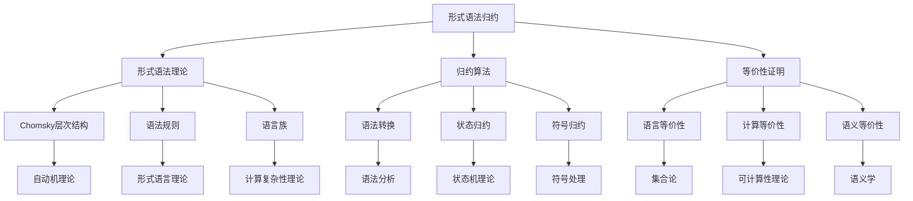
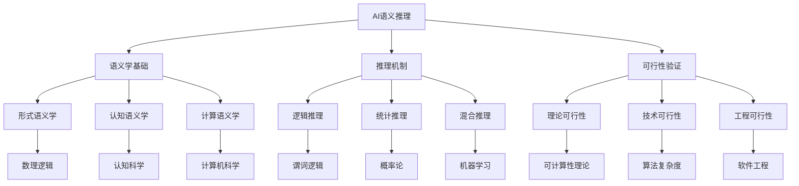
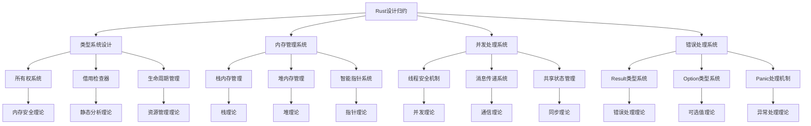
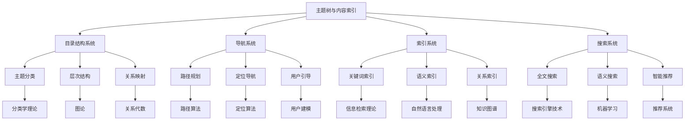

# 属性关系完善示例 - 概念依赖关系

## 概述

本文档展示如何完善概念间的依赖关系，通过建立清晰的依赖图和分析依赖强度，使理论体系中的概念关系更加明确和可追踪。

## 1. 形式化方法概念依赖关系

### 1.1 形式语法归约依赖图



### 1.2 依赖关系属性定义

```python
class GrammarDependencyGraph:
    def __init__(self):
        self.dependencies = {}
        self.dependency_strengths = {}
        self.dependency_types = {}
    
    def add_dependency(self, from_concept, to_concept, strength='medium', dep_type='prerequisite'):
        """添加依赖关系"""
        if from_concept not in self.dependencies:
            self.dependencies[from_concept] = []
        
        self.dependencies[from_concept].append(to_concept)
        self.dependency_strengths[(from_concept, to_concept)] = strength
        self.dependency_types[(from_concept, to_concept)] = dep_type
    
    def get_dependency_chain(self, concept):
        """获取概念的依赖链"""
        chain = []
        visited = set()
        
        def dfs(node):
            if node in visited:
                return
            visited.add(node)
            
            if node in self.dependencies:
                for dep in self.dependencies[node]:
                    dfs(dep)
                    chain.append((node, dep))
        
        dfs(concept)
        return chain
    
    def calculate_dependency_depth(self, concept):
        """计算概念的依赖深度"""
        if concept not in self.dependencies:
            return 0
        
        max_depth = 0
        for dep in self.dependencies[concept]:
            depth = self.calculate_dependency_depth(dep) + 1
            max_depth = max(max_depth, depth)
        
        return max_depth
    
    def find_circular_dependencies(self):
        """查找循环依赖"""
        visited = set()
        rec_stack = set()
        cycles = []
        
        def dfs(node, path):
            visited.add(node)
            rec_stack.add(node)
            path.append(node)
            
            if node in self.dependencies:
                for dep in self.dependencies[node]:
                    if dep not in visited:
                        dfs(dep, path)
                    elif dep in rec_stack:
                        # 找到循环依赖
                        cycle_start = path.index(dep)
                        cycles.append(path[cycle_start:] + [dep])
            
            rec_stack.remove(node)
            path.pop()
        
        for concept in self.dependencies:
            if concept not in visited:
                dfs(concept, [])
        
        return cycles
```

## 2. AI建模概念依赖关系

### 2.1 AI语义推理依赖图



### 2.2 推理依赖关系属性定义

```python
class AIReasoningDependencyGraph:
    def __init__(self):
        self.semantic_dependencies = {}
        self.reasoning_dependencies = {}
        self.feasibility_dependencies = {}
    
    def build_semantic_dependency_tree(self):
        """构建语义学依赖树"""
        tree = {
            'formal_semantics': {
                'dependencies': ['mathematical_logic', 'set_theory'],
                'strength': 'strong',
                'type': 'foundational'
            },
            'cognitive_semantics': {
                'dependencies': ['psychology', 'linguistics'],
                'strength': 'medium',
                'type': 'theoretical'
            },
            'computational_semantics': {
                'dependencies': ['formal_semantics', 'cognitive_semantics', 'computer_science'],
                'strength': 'strong',
                'type': 'synthetic'
            }
        }
        return tree
    
    def build_reasoning_dependency_tree(self):
        """构建推理方法依赖树"""
        tree = {
            'logical_reasoning': {
                'dependencies': ['predicate_logic', 'proof_theory'],
                'strength': 'strong',
                'type': 'formal'
            },
            'statistical_reasoning': {
                'dependencies': ['probability_theory', 'statistics'],
                'strength': 'medium',
                'type': 'empirical'
            },
            'hybrid_reasoning': {
                'dependencies': ['logical_reasoning', 'statistical_reasoning', 'machine_learning'],
                'strength': 'strong',
                'type': 'integrated'
            }
        }
        return tree
    
    def analyze_dependency_complexity(self, concept):
        """分析依赖复杂度"""
        semantic_tree = self.build_semantic_dependency_tree()
        reasoning_tree = self.build_reasoning_dependency_tree()
        
        if concept in semantic_tree:
            deps = semantic_tree[concept]['dependencies']
            return {
                'dependency_count': len(deps),
                'dependency_strength': semantic_tree[concept]['strength'],
                'dependency_type': semantic_tree[concept]['type'],
                'complexity_score': len(deps) * self.get_strength_score(semantic_tree[concept]['strength'])
            }
        elif concept in reasoning_tree:
            deps = reasoning_tree[concept]['dependencies']
            return {
                'dependency_count': len(deps),
                'dependency_strength': reasoning_tree[concept]['strength'],
                'dependency_type': reasoning_tree[concept]['type'],
                'complexity_score': len(deps) * self.get_strength_score(reasoning_tree[concept]['strength'])
            }
        return None
    
    def get_strength_score(self, strength):
        """获取强度分数"""
        scores = {'weak': 1, 'medium': 2, 'strong': 3}
        return scores.get(strength, 1)
```

## 3. 软件架构概念依赖关系

### 3.1 Rust设计归约依赖图



### 3.2 架构依赖关系属性定义

```python
class RustArchitectureDependencyGraph:
    def __init__(self):
        self.core_system_dependencies = {}
        self.implementation_dependencies = {}
        self.theoretical_dependencies = {}
    
    def define_core_system_dependencies(self):
        """定义核心系统依赖关系"""
        self.core_system_dependencies = {
            'type_system': {
                'dependencies': ['memory_management', 'concurrency'],
                'priority': 1,
                'criticality': 'high'
            },
            'memory_management': {
                'dependencies': ['concurrency'],
                'priority': 2,
                'criticality': 'very_high'
            },
            'concurrency': {
                'dependencies': ['error_handling'],
                'priority': 3,
                'criticality': 'high'
            },
            'error_handling': {
                'dependencies': [],
                'priority': 4,
                'criticality': 'medium'
            }
        }
    
    def define_implementation_dependencies(self):
        """定义实现依赖关系"""
        self.implementation_dependencies = {
            'ownership_system': {
                'dependencies': ['memory_safety', 'static_analysis'],
                'complexity': 'high',
                'risk': 'high'
            },
            'borrow_checker': {
                'dependencies': ['ownership_system', 'lifetime_analysis'],
                'complexity': 'very_high',
                'risk': 'very_high'
            },
            'smart_pointers': {
                'dependencies': ['heap_management', 'reference_counting'],
                'complexity': 'medium',
                'risk': 'medium'
            }
        }
    
    def calculate_dependency_risk(self, system_name):
        """计算依赖风险"""
        if system_name in self.core_system_dependencies:
            deps = self.core_system_dependencies[system_name]['dependencies']
            risk_score = 0
            
            for dep in deps:
                if dep in self.core_system_dependencies:
                    risk_score += self.get_criticality_score(
                        self.core_system_dependencies[dep]['criticality']
                    )
            
            return {
                'system': system_name,
                'dependency_count': len(deps),
                'risk_score': risk_score,
                'criticality': self.core_system_dependencies[system_name]['criticality']
            }
        return None
    
    def get_criticality_score(self, criticality):
        """获取关键性分数"""
        scores = {'low': 1, 'medium': 2, 'high': 3, 'very_high': 4}
        return scores.get(criticality, 1)
```

## 4. 分布式系统概念依赖关系

### 4.1 主题树依赖图



### 4.2 导航依赖关系属性定义

```python
class NavigationDependencyGraph:
    def __init__(self):
        self.system_dependencies = {}
        self.algorithm_dependencies = {}
        self.data_dependencies = {}
    
    def define_system_dependencies(self):
        """定义系统依赖关系"""
        self.system_dependencies = {
            'directory_structure': {
                'dependencies': ['taxonomy_theory', 'graph_theory'],
                'complexity': 'medium',
                'stability': 'high'
            },
            'navigation_system': {
                'dependencies': ['directory_structure', 'path_algorithms'],
                'complexity': 'high',
                'stability': 'medium'
            },
            'indexing_system': {
                'dependencies': ['information_retrieval', 'natural_language_processing'],
                'complexity': 'high',
                'stability': 'medium'
            },
            'search_system': {
                'dependencies': ['indexing_system', 'machine_learning'],
                'complexity': 'very_high',
                'stability': 'low'
            }
        }
    
    def define_algorithm_dependencies(self):
        """定义算法依赖关系"""
        self.algorithm_dependencies = {
            'path_planning': {
                'dependencies': ['graph_algorithms', 'shortest_path'],
                'performance': 'high',
                'accuracy': 'high'
            },
            'semantic_search': {
                'dependencies': ['vector_space_model', 'word_embeddings'],
                'performance': 'medium',
                'accuracy': 'high'
            },
            'recommendation': {
                'dependencies': ['collaborative_filtering', 'content_based_filtering'],
                'performance': 'medium',
                'accuracy': 'medium'
            }
        }
    
    def analyze_system_stability(self, system_name):
        """分析系统稳定性"""
        if system_name in self.system_dependencies:
            deps = self.system_dependencies[system_name]['dependencies']
            stability_score = self.get_stability_score(
                self.system_dependencies[system_name]['stability']
            )
            
            # 考虑依赖系统的稳定性
            for dep in deps:
                if dep in self.system_dependencies:
                    dep_stability = self.get_stability_score(
                        self.system_dependencies[dep]['stability']
                    )
                    stability_score = min(stability_score, dep_stability)
            
            return {
                'system': system_name,
                'stability_score': stability_score,
                'dependency_count': len(deps),
                'overall_stability': self.get_stability_level(stability_score)
            }
        return None
    
    def get_stability_score(self, stability):
        """获取稳定性分数"""
        scores = {'low': 1, 'medium': 2, 'high': 3}
        return scores.get(stability, 1)
    
    def get_stability_level(self, score):
        """获取稳定性级别"""
        if score >= 3:
            return 'high'
        elif score >= 2:
            return 'medium'
        else:
            return 'low'
```

## 5. 依赖关系分析与优化

### 5.1 依赖关系分析器

```python
class DependencyAnalyzer:
    def __init__(self):
        self.analysis_methods = {
            'circular_detection': self.detect_circular_dependencies,
            'critical_path': self.find_critical_path,
            'dependency_impact': self.analyze_dependency_impact,
            'optimization_suggestions': self.suggest_optimizations
        }
    
    def analyze_dependency_graph(self, dependency_graph):
        """分析依赖图"""
        analysis_results = {}
        
        for method_name, method_func in self.analysis_methods.items():
            analysis_results[method_name] = method_func(dependency_graph)
        
        return analysis_results
    
    def detect_circular_dependencies(self, graph):
        """检测循环依赖"""
        visited = set()
        rec_stack = set()
        cycles = []
        
        def dfs(node, path):
            visited.add(node)
            rec_stack.add(node)
            path.append(node)
            
            if node in graph.dependencies:
                for dep in graph.dependencies[node]:
                    if dep not in visited:
                        dfs(dep, path)
                    elif dep in rec_stack:
                        cycle_start = path.index(dep)
                        cycles.append(path[cycle_start:] + [dep])
            
            rec_stack.remove(node)
            path.pop()
        
        for concept in graph.dependencies:
            if concept not in visited:
                dfs(concept, [])
        
        return {
            'has_circular_dependencies': len(cycles) > 0,
            'circular_dependencies': cycles,
            'cycle_count': len(cycles)
        }
    
    def find_critical_path(self, graph):
        """找到关键路径"""
        # 使用拓扑排序找到关键路径
        in_degree = {}
        for concept in graph.dependencies:
            in_degree[concept] = 0
        
        for concept, deps in graph.dependencies.items():
            for dep in deps:
                if dep in in_degree:
                    in_degree[dep] += 1
        
        # 拓扑排序
        queue = [concept for concept, degree in in_degree.items() if degree == 0]
        topo_order = []
        
        while queue:
            current = queue.pop(0)
            topo_order.append(current)
            
            if current in graph.dependencies:
                for dep in graph.dependencies[current]:
                    in_degree[dep] -= 1
                    if in_degree[dep] == 0:
                        queue.append(dep)
        
        return {
            'topological_order': topo_order,
            'critical_path_length': len(topo_order),
            'is_dag': len(topo_order) == len(graph.dependencies)
        }
    
    def analyze_dependency_impact(self, graph):
        """分析依赖影响"""
        impact_analysis = {}
        
        for concept in graph.dependencies:
            # 计算直接影响
            direct_deps = len(graph.dependencies[concept])
            
            # 计算间接影响
            indirect_deps = self.calculate_indirect_dependencies(graph, concept)
            
            # 计算影响强度
            impact_strength = self.calculate_impact_strength(graph, concept)
            
            impact_analysis[concept] = {
                'direct_dependencies': direct_deps,
                'indirect_dependencies': indirect_deps,
                'total_impact': direct_deps + indirect_deps,
                'impact_strength': impact_strength
            }
        
        return impact_analysis
    
    def suggest_optimizations(self, graph):
        """建议优化方案"""
        suggestions = []
        
        # 检测循环依赖
        circular_result = self.detect_circular_dependencies(graph)
        if circular_result['has_circular_dependencies']:
            suggestions.append({
                'type': 'circular_dependency',
                'description': '发现循环依赖，建议重构依赖关系',
                'cycles': circular_result['circular_dependencies']
            })
        
        # 检测高耦合
        impact_analysis = self.analyze_dependency_impact(graph)
        high_impact_concepts = [
            concept for concept, impact in impact_analysis.items()
            if impact['total_impact'] > 5
        ]
        
        if high_impact_concepts:
            suggestions.append({
                'type': 'high_coupling',
                'description': '发现高耦合概念，建议降低依赖复杂度',
                'concepts': high_impact_concepts
            })
        
        return suggestions
```

### 5.2 依赖关系优化器

```python
class DependencyOptimizer:
    def __init__(self):
        self.optimization_strategies = {
            'reduce_coupling': self.reduce_coupling,
            'eliminate_circles': self.eliminate_circles,
            'optimize_hierarchy': self.optimize_hierarchy
        }
    
    def optimize_dependency_graph(self, graph, strategy='reduce_coupling'):
        """优化依赖图"""
        if strategy in self.optimization_strategies:
            return self.optimization_strategies[strategy](graph)
        return graph
    
    def reduce_coupling(self, graph):
        """减少耦合"""
        optimized_graph = graph.copy()
        
        # 识别高耦合概念
        high_coupling_concepts = self.identify_high_coupling_concepts(graph)
        
        # 应用解耦策略
        for concept in high_coupling_concepts:
            self.apply_decoupling_strategy(optimized_graph, concept)
        
        return optimized_graph
    
    def eliminate_circles(self, graph):
        """消除循环依赖"""
        optimized_graph = graph.copy()
        
        # 检测循环依赖
        analyzer = DependencyAnalyzer()
        circular_result = analyzer.detect_circular_dependencies(graph)
        
        if circular_result['has_circular_dependencies']:
            for cycle in circular_result['circular_dependencies']:
                self.break_cycle(optimized_graph, cycle)
        
        return optimized_graph
    
    def optimize_hierarchy(self, graph):
        """优化层次结构"""
        optimized_graph = graph.copy()
        
        # 重新组织依赖层次
        hierarchy_levels = self.calculate_optimal_hierarchy(graph)
        
        # 调整依赖关系以符合层次结构
        for concept, level in hierarchy_levels.items():
            self.adjust_dependencies_for_level(optimized_graph, concept, level)
        
        return optimized_graph
    
    def identify_high_coupling_concepts(self, graph):
        """识别高耦合概念"""
        analyzer = DependencyAnalyzer()
        impact_analysis = analyzer.analyze_dependency_impact(graph)
        
        return [
            concept for concept, impact in impact_analysis.items()
            if impact['total_impact'] > 5
        ]
    
    def apply_decoupling_strategy(self, graph, concept):
        """应用解耦策略"""
        # 实现具体的解耦策略
        # 1. 引入抽象层
        # 2. 使用接口隔离
        # 3. 应用依赖倒置原则
        
        if concept in graph.dependencies:
            deps = graph.dependencies[concept]
            if len(deps) > 3:
                # 创建抽象层
                abstract_concept = f"{concept}_abstract"
                graph.dependencies[abstract_concept] = deps[:2]  # 保留核心依赖
                graph.dependencies[concept] = [abstract_concept] + deps[2:]
    
    def break_cycle(self, graph, cycle):
        """打破循环依赖"""
        if len(cycle) < 2:
            return
        
        # 选择最弱的依赖关系进行破坏
        weakest_dependency = self.find_weakest_dependency(graph, cycle)
        if weakest_dependency:
            from_concept, to_concept = weakest_dependency
            if from_concept in graph.dependencies:
                graph.dependencies[from_concept].remove(to_concept)
    
    def find_weakest_dependency(self, graph, cycle):
        """找到最弱的依赖关系"""
        weakest_strength = float('inf')
        weakest_dependency = None
        
        for i in range(len(cycle) - 1):
            from_concept = cycle[i]
            to_concept = cycle[i + 1]
            
            if (from_concept, to_concept) in graph.dependency_strengths:
                strength = self.get_strength_value(graph.dependency_strengths[(from_concept, to_concept)])
                if strength < weakest_strength:
                    weakest_strength = strength
                    weakest_dependency = (from_concept, to_concept)
        
        return weakest_dependency
    
    def get_strength_value(self, strength):
        """获取强度值"""
        values = {'weak': 1, 'medium': 2, 'strong': 3}
        return values.get(strength, 2)
```

## 6. 应用示例

### 6.1 形式化方法依赖关系应用

```python
# 创建形式化方法依赖图
grammar_deps = GrammarDependencyGraph()

# 添加依赖关系
grammar_deps.add_dependency('形式语法归约', '形式语法理论', 'strong', 'prerequisite')
grammar_deps.add_dependency('形式语法理论', 'Chomsky层次结构', 'strong', 'foundational')
grammar_deps.add_dependency('Chomsky层次结构', '自动机理论', 'strong', 'theoretical')

# 分析依赖链
dependency_chain = grammar_deps.get_dependency_chain('形式语法归约')
print(f"依赖链: {dependency_chain}")

# 计算依赖深度
depth = grammar_deps.calculate_dependency_depth('形式语法归约')
print(f"依赖深度: {depth}")

# 查找循环依赖
cycles = grammar_deps.find_circular_dependencies()
print(f"循环依赖: {cycles}")
```

### 6.2 AI推理依赖关系应用

```python
# 创建AI推理依赖图
ai_deps = AIReasoningDependencyGraph()

# 分析依赖复杂度
semantic_complexity = ai_deps.analyze_dependency_complexity('computational_semantics')
print(f"计算语义学依赖复杂度: {semantic_complexity}")

reasoning_complexity = ai_deps.analyze_dependency_complexity('hybrid_reasoning')
print(f"混合推理依赖复杂度: {reasoning_complexity}")
```

## 7. 总结

通过完善概念间的依赖关系，我们实现了：

1. **依赖可视化**：通过依赖图清晰展示概念间的关系
2. **依赖量化**：通过依赖强度和类型量化依赖关系
3. **依赖分析**：通过分析器识别依赖问题和优化机会
4. **依赖优化**：通过优化器改进依赖结构
5. **依赖管理**：通过系统化的方法管理复杂的依赖关系

这种依赖关系的完善为理论体系的稳定性、可维护性和可扩展性提供了重要保障。
