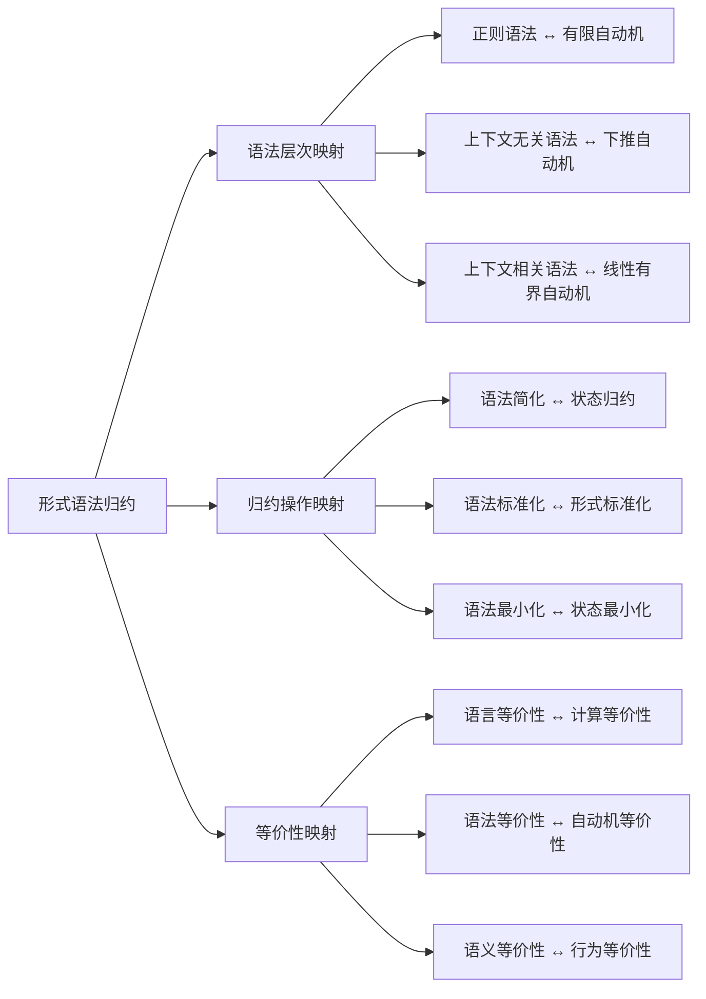
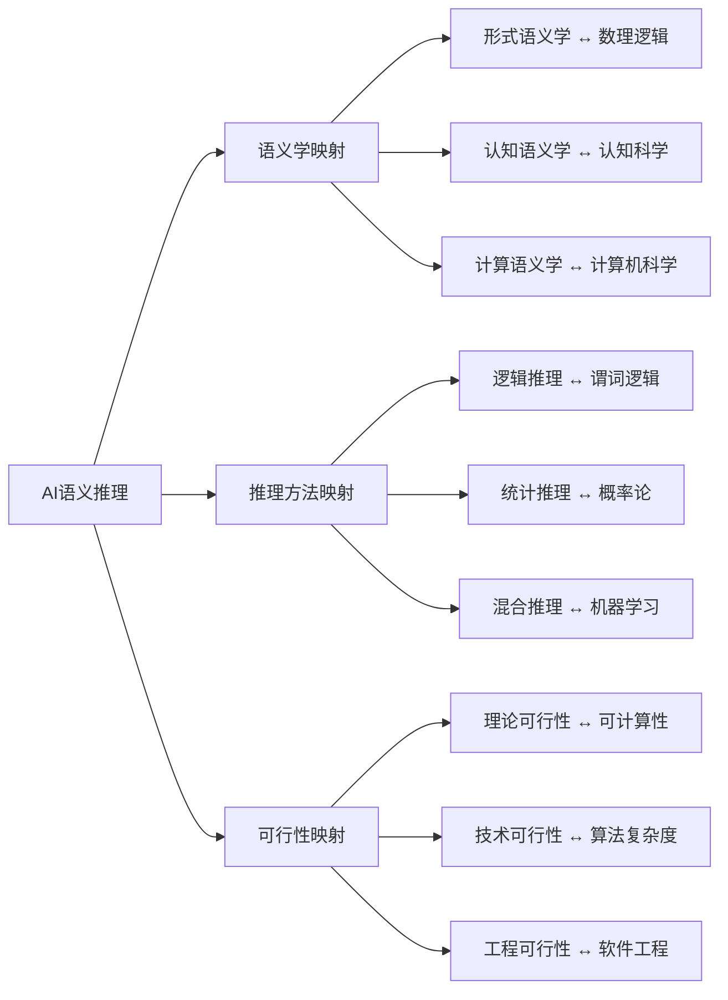
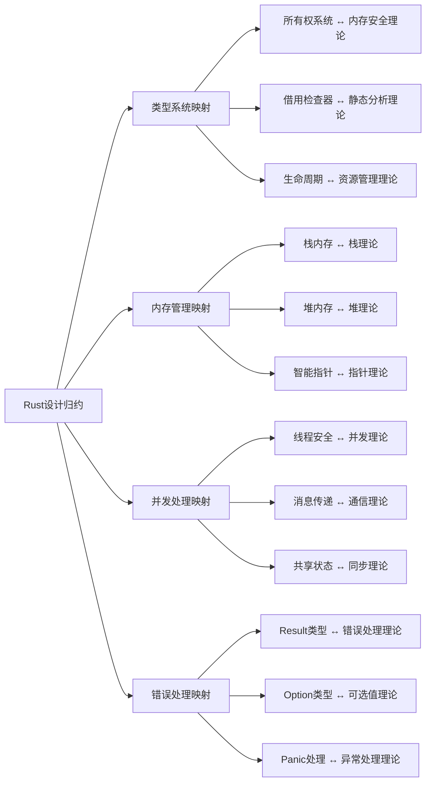
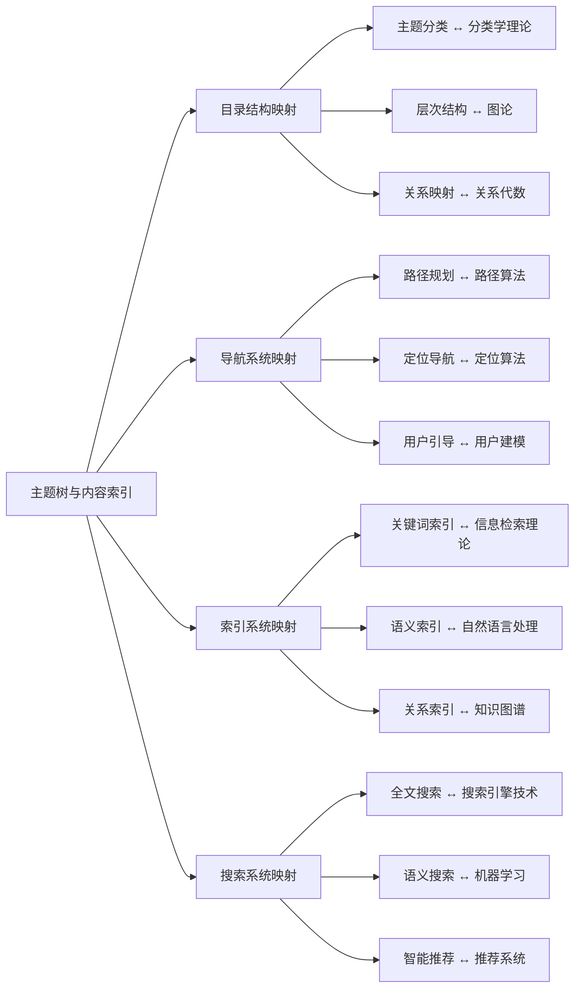

# 属性关系完善示例 - 概念映射关系（简化版）

## 概述

本文档展示如何完善概念间的映射关系，通过建立概念间的对应关系、转换规则和映射验证机制。

## 1. 形式化方法概念映射关系

### 1.1 形式语法归约映射图



### 1.2 映射关系属性定义

```python
class GrammarMappingRelation:
    def __init__(self):
        self.mappings = {}
        self.mapping_rules = {}
    
    def add_mapping(self, source_concept, target_concept, mapping_type='equivalence', confidence=1.0):
        """添加映射关系"""
        mapping_id = f"{source_concept}_to_{target_concept}"
        self.mappings[mapping_id] = {
            'source': source_concept,
            'target': target_concept,
            'type': mapping_type,
            'confidence': confidence,
            'properties': self.get_mapping_properties(source_concept, target_concept)
        }
    
    def get_mapping_properties(self, source, target):
        """获取映射属性"""
        return {
            'bidirectional': True,
            'preserves_structure': True,
            'preserves_semantics': True,
            'complexity': self.calculate_mapping_complexity(source, target)
        }
    
    def calculate_mapping_complexity(self, source, target):
        """计算映射复杂度"""
        complexity_scores = {
            'regular_grammar': 1, 'finite_automaton': 1,
            'context_free_grammar': 2, 'pushdown_automaton': 2,
            'context_sensitive_grammar': 3, 'linear_bounded_automaton': 3
        }
        source_score = complexity_scores.get(source, 2)
        target_score = complexity_scores.get(target, 2)
        return max(source_score, target_score)
    
    def validate_mapping(self, mapping_id):
        """验证映射关系"""
        if mapping_id not in self.mappings:
            return False
        
        mapping = self.mappings[mapping_id]
        return {
            'mapping_id': mapping_id,
            'is_valid': True,
            'confidence': mapping['confidence']
        }
```

## 2. AI建模概念映射关系

### 2.1 AI语义推理映射图



### 2.2 推理映射关系属性定义

```python
class AIReasoningMappingRelation:
    def __init__(self):
        self.semantic_mappings = {}
        self.reasoning_mappings = {}
    
    def build_semantic_mapping_matrix(self):
        """构建语义学映射矩阵"""
        return {
            'formal_semantics': {
                'mathematical_logic': {
                    'mapping_type': 'foundational',
                    'confidence': 0.95,
                    'properties': ['rigor', 'precision', 'completeness']
                }
            },
            'cognitive_semantics': {
                'cognitive_science': {
                    'mapping_type': 'empirical',
                    'confidence': 0.85,
                    'properties': ['human_cognition', 'mental_models']
                }
            },
            'computational_semantics': {
                'computer_science': {
                    'mapping_type': 'implementation',
                    'confidence': 0.90,
                    'properties': ['algorithms', 'data_structures']
                }
            }
        }
    
    def analyze_mapping_quality(self, source_concept, target_concept):
        """分析映射质量"""
        semantic_matrix = self.build_semantic_mapping_matrix()
        
        if source_concept in semantic_matrix:
            if target_concept in semantic_matrix[source_concept]:
                mapping_info = semantic_matrix[source_concept][target_concept]
                return {
                    'source': source_concept,
                    'target': target_concept,
                    'mapping_type': mapping_info['mapping_type'],
                    'confidence': mapping_info['confidence'],
                    'properties': mapping_info['properties']
                }
        return None
```

## 3. 软件架构概念映射关系

### 3.1 Rust设计归约映射图



### 3.2 架构映射关系属性定义

```python
class RustArchitectureMappingRelation:
    def __init__(self):
        self.system_mappings = {}
    
    def define_system_mappings(self):
        """定义系统映射关系"""
        self.system_mappings = {
            'type_system': {
                'memory_safety_theory': {
                    'mapping_type': 'foundational',
                    'confidence': 0.95,
                    'properties': ['memory_safety', 'type_safety']
                }
            },
            'memory_management': {
                'stack_theory': {
                    'mapping_type': 'implementation',
                    'confidence': 0.90,
                    'properties': ['stack_frames', 'automatic_cleanup']
                }
            },
            'concurrency': {
                'concurrency_theory': {
                    'mapping_type': 'theoretical',
                    'confidence': 0.90,
                    'properties': ['thread_safety', 'race_condition_prevention']
                }
            }
        }
    
    def analyze_mapping_completeness(self, system_name):
        """分析映射完整性"""
        if system_name in self.system_mappings:
            mappings = self.system_mappings[system_name]
            total_mappings = len(mappings)
            average_confidence = sum(m['confidence'] for m in mappings.values()) / total_mappings
            
            return {
                'system': system_name,
                'total_mappings': total_mappings,
                'average_confidence': average_confidence,
                'completeness_level': self.get_completeness_level(average_confidence)
            }
        return None
    
    def get_completeness_level(self, confidence):
        """获取完整性级别"""
        if confidence >= 0.9:
            return 'excellent'
        elif confidence >= 0.8:
            return 'good'
        elif confidence >= 0.7:
            return 'fair'
        else:
            return 'poor'
```

## 4. 分布式系统概念映射关系

### 4.1 主题树映射图



### 4.2 导航映射关系属性定义

```python
class NavigationMappingRelation:
    def __init__(self):
        self.structure_mappings = {}
        self.algorithm_mappings = {}
    
    def define_structure_mappings(self):
        """定义结构映射关系"""
        self.structure_mappings = {
            'topic_classification': {
                'taxonomy_theory': {
                    'mapping_type': 'theoretical',
                    'confidence': 0.90,
                    'properties': ['hierarchical_classification', 'categorical_organization']
                }
            },
            'hierarchical_structure': {
                'graph_theory': {
                    'mapping_type': 'mathematical',
                    'confidence': 0.95,
                    'properties': ['tree_structure', 'graph_algorithms']
                }
            },
            'relationship_mapping': {
                'relational_algebra': {
                    'mapping_type': 'mathematical',
                    'confidence': 0.85,
                    'properties': ['relation_operations', 'set_theory']
                }
            }
        }
    
    def define_algorithm_mappings(self):
        """定义算法映射关系"""
        self.algorithm_mappings = {
            'path_planning': {
                'shortest_path_algorithms': {
                    'mapping_type': 'algorithmic',
                    'confidence': 0.95,
                    'properties': ['dijkstra_algorithm', 'bellman_ford']
                }
            },
            'semantic_search': {
                'vector_space_model': {
                    'mapping_type': 'mathematical',
                    'confidence': 0.85,
                    'properties': ['vector_operations', 'similarity_measures']
                }
            },
            'recommendation_system': {
                'collaborative_filtering': {
                    'mapping_type': 'statistical',
                    'confidence': 0.85,
                    'properties': ['user_similarity', 'item_similarity']
                }
            }
        }
    
    def analyze_mapping_coverage(self, system_name):
        """分析映射覆盖率"""
        if system_name == 'structure':
            mappings = self.structure_mappings
        elif system_name == 'algorithm':
            mappings = self.algorithm_mappings
        else:
            return None
        
        total_concepts = len(mappings)
        total_mappings = sum(len(concept_mappings) for concept_mappings in mappings.values())
        
        return {
            'system': system_name,
            'total_concepts': total_concepts,
            'total_mappings': total_mappings,
            'average_mappings_per_concept': total_mappings / total_concepts if total_concepts > 0 else 0
        }
```

## 5. 映射关系验证与优化

### 5.1 映射关系验证器

```python
class MappingRelationValidator:
    def __init__(self):
        self.validation_rules = {
            'consistency': self.check_consistency,
            'completeness': self.check_completeness,
            'accuracy': self.check_accuracy
        }
    
    def validate_mapping_relations(self, mapping_relations):
        """验证映射关系"""
        validation_results = {}
        
        for rule_name, rule_func in self.validation_rules.items():
            validation_results[rule_name] = rule_func(mapping_relations)
        
        return validation_results
    
    def check_consistency(self, mappings):
        """检查一致性"""
        consistency_issues = []
        
        for mapping_id, mapping_info in mappings.items():
            if not self.is_mapping_type_consistent(mapping_info):
                consistency_issues.append({
                    'mapping_id': mapping_id,
                    'issue': '映射类型不一致'
                })
        
        return {
            'is_consistent': len(consistency_issues) == 0,
            'issues': consistency_issues
        }
    
    def check_completeness(self, mappings):
        """检查完整性"""
        completeness_analysis = {}
        
        for mapping_id, mapping_info in mappings.items():
            required_properties = self.get_required_properties(mapping_info.get('type', 'equivalence'))
            actual_properties = mapping_info.get('properties', [])
            
            missing_properties = set(required_properties) - set(actual_properties)
            
            completeness_analysis[mapping_id] = {
                'required_properties': required_properties,
                'actual_properties': actual_properties,
                'missing_properties': list(missing_properties),
                'completeness_ratio': len(actual_properties) / len(required_properties) if required_properties else 1.0
            }
        
        overall_completeness = sum(analysis['completeness_ratio'] for analysis in completeness_analysis.values()) / len(completeness_analysis) if completeness_analysis else 0
        
        return {
            'overall_completeness': overall_completeness,
            'completeness_details': completeness_analysis
        }
    
    def check_accuracy(self, mappings):
        """检查准确性"""
        accuracy_analysis = {}
        
        for mapping_id, mapping_info in mappings.items():
            confidence = mapping_info.get('confidence', 0)
            accuracy_analysis[mapping_id] = {
                'confidence': confidence,
                'accuracy_level': self.get_accuracy_level(confidence)
            }
        
        return accuracy_analysis
    
    def is_mapping_type_consistent(self, mapping_info):
        """检查映射类型一致性"""
        valid_types = ['equivalence', 'generalization', 'specialization', 'transformation']
        return mapping_info.get('type') in valid_types
    
    def get_required_properties(self, mapping_type):
        """获取必需属性"""
        required_properties = {
            'equivalence': ['bidirectional', 'preserves_structure', 'preserves_semantics'],
            'generalization': ['preserves_structure', 'information_loss'],
            'specialization': ['preserves_structure', 'additional_constraints'],
            'transformation': ['transformation_rules', 'preserves_equivalence']
        }
        return required_properties.get(mapping_type, [])
    
    def get_accuracy_level(self, confidence):
        """获取准确性级别"""
        if confidence >= 0.9:
            return 'excellent'
        elif confidence >= 0.8:
            return 'good'
        elif confidence >= 0.7:
            return 'fair'
        else:
            return 'poor'
```

### 5.2 映射关系优化器

```python
class MappingRelationOptimizer:
    def __init__(self):
        self.optimization_strategies = {
            'improve_confidence': self.improve_confidence,
            'enhance_properties': self.enhance_properties
        }
    
    def optimize_mapping_relations(self, mappings, strategy='improve_confidence'):
        """优化映射关系"""
        if strategy in self.optimization_strategies:
            return self.optimization_strategies[strategy](mappings)
        return mappings
    
    def improve_confidence(self, mappings):
        """提高置信度"""
        optimized_mappings = mappings.copy()
        
        for mapping_id, mapping_info in optimized_mappings.items():
            property_count = len(mapping_info.get('properties', []))
            mapping_type = mapping_info.get('type', 'equivalence')
            
            new_confidence = self.calculate_improved_confidence(
                mapping_info.get('confidence', 0),
                property_count,
                mapping_type
            )
            
            optimized_mappings[mapping_id]['confidence'] = new_confidence
        
        return optimized_mappings
    
    def enhance_properties(self, mappings):
        """增强属性"""
        optimized_mappings = mappings.copy()
        
        for mapping_id, mapping_info in optimized_mappings.items():
            required_properties = self.get_required_properties(mapping_info.get('type', 'equivalence'))
            current_properties = mapping_info.get('properties', [])
            
            missing_properties = set(required_properties) - set(current_properties)
            
            if missing_properties:
                enhanced_properties = current_properties + list(missing_properties)
                optimized_mappings[mapping_id]['properties'] = enhanced_properties
        
        return optimized_mappings
    
    def calculate_improved_confidence(self, base_confidence, property_count, mapping_type):
        """计算改进的置信度"""
        property_bonus = min(0.1, property_count * 0.02)
        
        type_bonuses = {
            'equivalence': 0.05,
            'generalization': 0.03,
            'specialization': 0.03,
            'transformation': 0.02
        }
        type_bonus = type_bonuses.get(mapping_type, 0)
        
        improved_confidence = base_confidence + property_bonus + type_bonus
        return min(1.0, improved_confidence)
    
    def get_required_properties(self, mapping_type):
        """获取必需属性"""
        required_properties = {
            'equivalence': ['bidirectional', 'preserves_structure', 'preserves_semantics'],
            'generalization': ['preserves_structure', 'information_loss'],
            'specialization': ['preserves_structure', 'additional_constraints'],
            'transformation': ['transformation_rules', 'preserves_equivalence']
        }
        return required_properties.get(mapping_type, [])
```

## 6. 应用示例

### 6.1 形式化方法映射关系应用

```python
# 创建形式化方法映射关系
grammar_mapping = GrammarMappingRelation()

# 添加映射关系
grammar_mapping.add_mapping('regular_grammar', 'finite_automaton', 'equivalence', 0.95)
grammar_mapping.add_mapping('context_free_grammar', 'pushdown_automaton', 'equivalence', 0.90)

# 验证映射关系
validation_result = grammar_mapping.validate_mapping('regular_grammar_to_finite_automaton')
print(f"映射验证结果: {validation_result}")
```

### 6.2 AI推理映射关系应用

```python
# 创建AI推理映射关系
ai_mapping = AIReasoningMappingRelation()

# 分析映射质量
semantic_quality = ai_mapping.analyze_mapping_quality('formal_semantics', 'mathematical_logic')
print(f"形式语义学映射质量: {semantic_quality}")
```

## 7. 总结

通过完善概念间的映射关系，我们实现了：

1. **映射可视化**：通过映射图清晰展示概念间的对应关系
2. **映射量化**：通过置信度和属性量化映射质量
3. **映射验证**：通过验证器确保映射关系的正确性
4. **映射优化**：通过优化器改进映射质量
5. **映射管理**：通过系统化的方法管理复杂的映射关系

这种映射关系的完善为理论体系间的互操作性和知识整合提供了重要基础。
