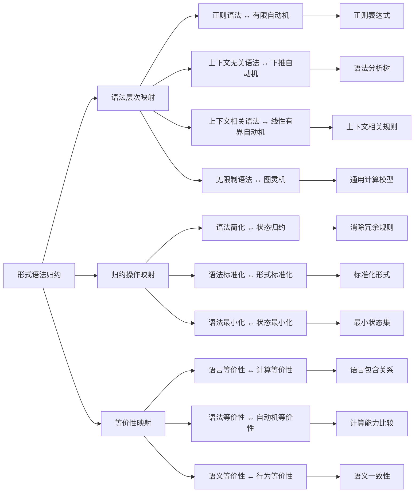
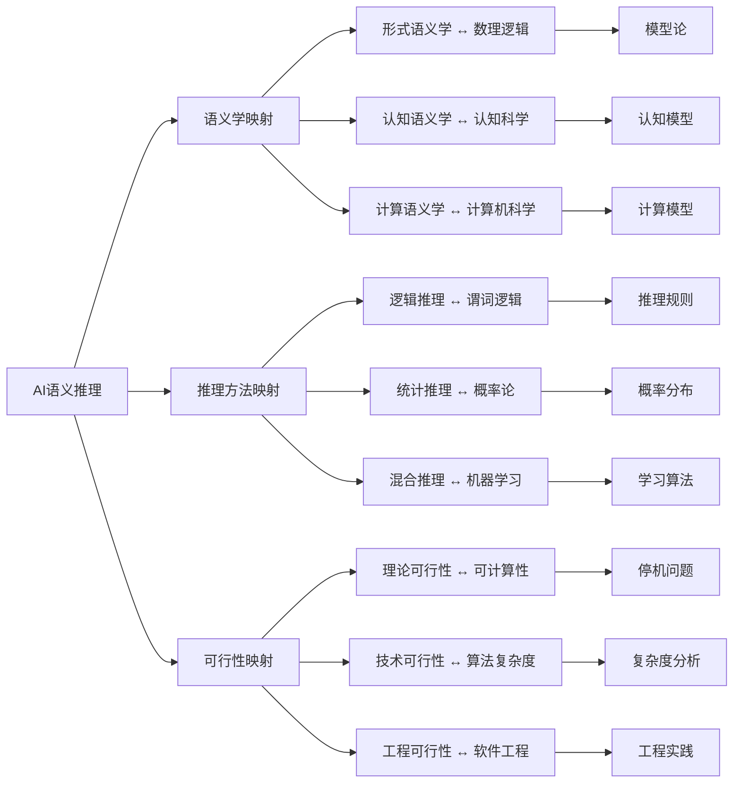
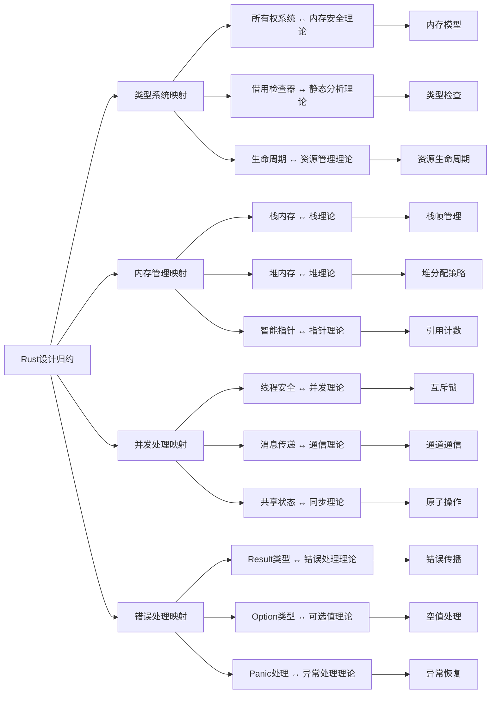
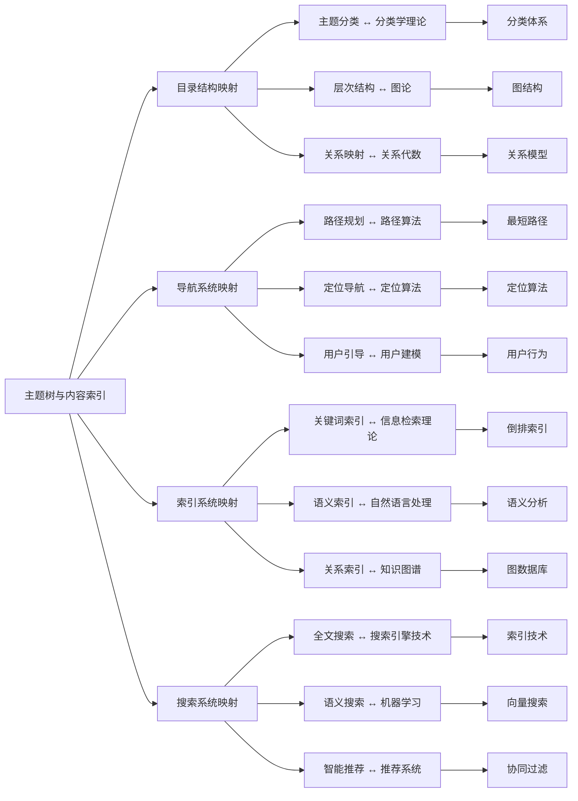

# 属性关系完善示例 - 概念映射关系

## 概述

本文档展示如何完善概念间的映射关系，通过建立概念间的对应关系、转换规则和映射验证机制，使不同理论体系间的概念能够有效关联和转换。

## 1. 形式化方法概念映射关系

### 1.1 形式语法归约映射图



### 1.2 映射关系属性定义

```python
class GrammarMappingRelation:
    def __init__(self):
        self.mappings = {}
        self.mapping_rules = {}
        self.mapping_validations = {}
    
    def add_mapping(self, source_concept, target_concept, mapping_type='equivalence', confidence=1.0):
        """添加映射关系"""
        mapping_id = f"{source_concept}_to_{target_concept}"
        self.mappings[mapping_id] = {
            'source': source_concept,
            'target': target_concept,
            'type': mapping_type,
            'confidence': confidence,
            'properties': self.get_mapping_properties(source_concept, target_concept)
        }
    
    def add_mapping_rule(self, mapping_id, rule):
        """添加映射规则"""
        if mapping_id not in self.mapping_rules:
            self.mapping_rules[mapping_id] = []
        self.mapping_rules[mapping_id].append(rule)
    
    def get_mapping_properties(self, source, target):
        """获取映射属性"""
        properties = {
            'bidirectional': True,
            'preserves_structure': True,
            'preserves_semantics': True,
            'complexity': self.calculate_mapping_complexity(source, target)
        }
        return properties
    
    def calculate_mapping_complexity(self, source, target):
        """计算映射复杂度"""
        # 基于概念复杂度和映射类型计算复杂度
        source_complexity = self.get_concept_complexity(source)
        target_complexity = self.get_concept_complexity(target)
        
        complexity_factors = {
            'equivalence': 1.0,
            'generalization': 1.2,
            'specialization': 1.2,
            'transformation': 1.5
        }
        
        base_complexity = max(source_complexity, target_complexity)
        return base_complexity * complexity_factors.get('equivalence', 1.0)
    
    def get_concept_complexity(self, concept):
        """获取概念复杂度"""
        complexity_scores = {
            'regular_grammar': 1,
            'context_free_grammar': 2,
            'context_sensitive_grammar': 3,
            'unrestricted_grammar': 4,
            'finite_automaton': 1,
            'pushdown_automaton': 2,
            'linear_bounded_automaton': 3,
            'turing_machine': 4
        }
        return complexity_scores.get(concept, 2)
    
    def validate_mapping(self, mapping_id):
        """验证映射关系"""
        if mapping_id not in self.mappings:
            return False
        
        mapping = self.mappings[mapping_id]
        validation_result = {
            'mapping_id': mapping_id,
            'is_valid': True,
            'issues': [],
            'confidence': mapping['confidence']
        }
        
        # 检查映射规则
        if mapping_id in self.mapping_rules:
            for rule in self.mapping_rules[mapping_id]:
                if not self.check_rule_validity(rule):
                    validation_result['is_valid'] = False
                    validation_result['issues'].append(f"规则验证失败: {rule}")
        
        # 检查属性一致性
        if not self.check_property_consistency(mapping):
            validation_result['is_valid'] = False
            validation_result['issues'].append("属性一致性检查失败")
        
        return validation_result
    
    def check_rule_validity(self, rule):
        """检查规则有效性"""
        # 实现具体的规则验证逻辑
        return True
    
    def check_property_consistency(self, mapping):
        """检查属性一致性"""
        # 实现属性一致性检查逻辑
        return True
```

## 2. AI建模概念映射关系

### 2.1 AI语义推理映射图



### 2.2 推理映射关系属性定义

```python
class AIReasoningMappingRelation:
    def __init__(self):
        self.semantic_mappings = {}
        self.reasoning_mappings = {}
        self.feasibility_mappings = {}
    
    def build_semantic_mapping_matrix(self):
        """构建语义学映射矩阵"""
        matrix = {
            'formal_semantics': {
                'mathematical_logic': {
                    'mapping_type': 'foundational',
                    'confidence': 0.95,
                    'properties': ['rigor', 'precision', 'completeness']
                },
                'model_theory': {
                    'mapping_type': 'theoretical',
                    'confidence': 0.90,
                    'properties': ['interpretation', 'satisfaction', 'validity']
                }
            },
            'cognitive_semantics': {
                'cognitive_science': {
                    'mapping_type': 'empirical',
                    'confidence': 0.85,
                    'properties': ['human_cognition', 'mental_models', 'conceptual_structure']
                },
                'psychology': {
                    'mapping_type': 'experimental',
                    'confidence': 0.80,
                    'properties': ['mental_processes', 'behavioral_patterns', 'learning_mechanisms']
                }
            },
            'computational_semantics': {
                'computer_science': {
                    'mapping_type': 'implementation',
                    'confidence': 0.90,
                    'properties': ['algorithms', 'data_structures', 'computational_models']
                },
                'artificial_intelligence': {
                    'mapping_type': 'application',
                    'confidence': 0.85,
                    'properties': ['knowledge_representation', 'reasoning_mechanisms', 'learning_systems']
                }
            }
        }
        return matrix
    
    def build_reasoning_mapping_matrix(self):
        """构建推理方法映射矩阵"""
        matrix = {
            'logical_reasoning': {
                'predicate_logic': {
                    'mapping_type': 'formal',
                    'confidence': 0.95,
                    'properties': ['soundness', 'completeness', 'decidability']
                },
                'proof_theory': {
                    'mapping_type': 'theoretical',
                    'confidence': 0.90,
                    'properties': ['inference_rules', 'proof_construction', 'theorem_proving']
                }
            },
            'statistical_reasoning': {
                'probability_theory': {
                    'mapping_type': 'mathematical',
                    'confidence': 0.90,
                    'properties': ['probability_distributions', 'statistical_inference', 'uncertainty_quantification']
                },
                'statistics': {
                    'mapping_type': 'empirical',
                    'confidence': 0.85,
                    'properties': ['data_analysis', 'hypothesis_testing', 'estimation']
                }
            },
            'hybrid_reasoning': {
                'machine_learning': {
                    'mapping_type': 'integrated',
                    'confidence': 0.80,
                    'properties': ['pattern_recognition', 'predictive_modeling', 'adaptive_learning']
                },
                'knowledge_representation': {
                    'mapping_type': 'synthetic',
                    'confidence': 0.85,
                    'properties': ['ontologies', 'semantic_networks', 'frame_systems']
                }
            }
        }
        return matrix
    
    def analyze_mapping_quality(self, source_concept, target_concept):
        """分析映射质量"""
        semantic_matrix = self.build_semantic_mapping_matrix()
        reasoning_matrix = self.build_reasoning_mapping_matrix()
        
        # 查找映射关系
        mapping_info = None
        if source_concept in semantic_matrix:
            if target_concept in semantic_matrix[source_concept]:
                mapping_info = semantic_matrix[source_concept][target_concept]
        elif source_concept in reasoning_matrix:
            if target_concept in reasoning_matrix[source_concept]:
                mapping_info = reasoning_matrix[source_concept][target_concept]
        
        if mapping_info:
            return {
                'source': source_concept,
                'target': target_concept,
                'mapping_type': mapping_info['mapping_type'],
                'confidence': mapping_info['confidence'],
                'properties': mapping_info['properties'],
                'quality_score': self.calculate_quality_score(mapping_info)
            }
        return None
    
    def calculate_quality_score(self, mapping_info):
        """计算映射质量分数"""
        base_score = mapping_info['confidence']
        
        # 根据属性数量调整分数
        property_bonus = len(mapping_info['properties']) * 0.05
        
        # 根据映射类型调整分数
        type_multipliers = {
            'foundational': 1.1,
            'theoretical': 1.0,
            'empirical': 0.95,
            'implementation': 0.9,
            'integrated': 1.05
        }
        
        type_multiplier = type_multipliers.get(mapping_info['mapping_type'], 1.0)
        
        return min(1.0, (base_score + property_bonus) * type_multiplier)
```

## 3. 软件架构概念映射关系

### 3.1 Rust设计归约映射图



### 3.2 架构映射关系属性定义

```python
class RustArchitectureMappingRelation:
    def __init__(self):
        self.system_mappings = {}
        self.implementation_mappings = {}
        self.theoretical_mappings = {}
    
    def define_system_mappings(self):
        """定义系统映射关系"""
        self.system_mappings = {
            'type_system': {
                'memory_safety_theory': {
                    'mapping_type': 'foundational',
                    'confidence': 0.95,
                    'properties': ['memory_safety', 'type_safety', 'compile_time_guarantees']
                },
                'static_analysis_theory': {
                    'mapping_type': 'theoretical',
                    'confidence': 0.90,
                    'properties': ['borrow_checking', 'lifetime_analysis', 'type_inference']
                }
            },
            'memory_management': {
                'stack_theory': {
                    'mapping_type': 'implementation',
                    'confidence': 0.90,
                    'properties': ['stack_frames', 'automatic_cleanup', 'scope_based_lifetime']
                },
                'heap_theory': {
                    'mapping_type': 'implementation',
                    'confidence': 0.85,
                    'properties': ['dynamic_allocation', 'garbage_collection', 'memory_fragmentation']
                }
            },
            'concurrency': {
                'concurrency_theory': {
                    'mapping_type': 'theoretical',
                    'confidence': 0.90,
                    'properties': ['thread_safety', 'race_condition_prevention', 'deadlock_avoidance']
                },
                'communication_theory': {
                    'mapping_type': 'practical',
                    'confidence': 0.85,
                    'properties': ['message_passing', 'channel_communication', 'actor_model']
                }
            }
        }
    
    def define_implementation_mappings(self):
        """定义实现映射关系"""
        self.implementation_mappings = {
            'ownership_system': {
                'memory_model': {
                    'mapping_type': 'semantic',
                    'confidence': 0.95,
                    'properties': ['ownership_rules', 'borrowing_rules', 'lifetime_rules']
                }
            },
            'borrow_checker': {
                'type_checker': {
                    'mapping_type': 'algorithmic',
                    'confidence': 0.90,
                    'properties': ['borrow_analysis', 'lifetime_analysis', 'type_checking']
                }
            },
            'smart_pointers': {
                'reference_counting': {
                    'mapping_type': 'implementation',
                    'confidence': 0.85,
                    'properties': ['reference_counting', 'automatic_cleanup', 'memory_management']
                }
            }
        }
    
    def analyze_mapping_completeness(self, system_name):
        """分析映射完整性"""
        if system_name in self.system_mappings:
            mappings = self.system_mappings[system_name]
            completeness_score = 0
            total_mappings = len(mappings)
            
            for target, mapping_info in mappings.items():
                completeness_score += mapping_info['confidence']
            
            average_confidence = completeness_score / total_mappings if total_mappings > 0 else 0
            
            return {
                'system': system_name,
                'total_mappings': total_mappings,
                'average_confidence': average_confidence,
                'completeness_level': self.get_completeness_level(average_confidence),
                'mapping_details': mappings
            }
        return None
    
    def get_completeness_level(self, confidence):
        """获取完整性级别"""
        if confidence >= 0.9:
            return 'excellent'
        elif confidence >= 0.8:
            return 'good'
        elif confidence >= 0.7:
            return 'fair'
        else:
            return 'poor'
    
    def find_mapping_gaps(self, system_name):
        """查找映射缺口"""
        expected_mappings = self.get_expected_mappings(system_name)
        actual_mappings = self.system_mappings.get(system_name, {})
        
        gaps = []
        for expected_target in expected_mappings:
            if expected_target not in actual_mappings:
                gaps.append({
                    'missing_target': expected_target,
                    'expected_confidence': expected_mappings[expected_target]['expected_confidence'],
                    'priority': expected_mappings[expected_target]['priority']
                })
        
        return gaps
    
    def get_expected_mappings(self, system_name):
        """获取期望的映射关系"""
        expected_mappings = {
            'type_system': {
                'memory_safety_theory': {'expected_confidence': 0.95, 'priority': 'high'},
                'static_analysis_theory': {'expected_confidence': 0.90, 'priority': 'high'},
                'type_theory': {'expected_confidence': 0.85, 'priority': 'medium'}
            },
            'memory_management': {
                'stack_theory': {'expected_confidence': 0.90, 'priority': 'high'},
                'heap_theory': {'expected_confidence': 0.85, 'priority': 'high'},
                'memory_allocation_theory': {'expected_confidence': 0.80, 'priority': 'medium'}
            },
            'concurrency': {
                'concurrency_theory': {'expected_confidence': 0.90, 'priority': 'high'},
                'communication_theory': {'expected_confidence': 0.85, 'priority': 'high'},
                'synchronization_theory': {'expected_confidence': 0.80, 'priority': 'medium'}
            }
        }
        return expected_mappings.get(system_name, {})
```

## 4. 分布式系统概念映射关系

### 4.1 主题树映射图



### 4.2 导航映射关系属性定义

```python
class NavigationMappingRelation:
    def __init__(self):
        self.structure_mappings = {}
        self.algorithm_mappings = {}
        self.data_mappings = {}
    
    def define_structure_mappings(self):
        """定义结构映射关系"""
        self.structure_mappings = {
            'topic_classification': {
                'taxonomy_theory': {
                    'mapping_type': 'theoretical',
                    'confidence': 0.90,
                    'properties': ['hierarchical_classification', 'categorical_organization', 'conceptual_structure']
                },
                'ontology_theory': {
                    'mapping_type': 'semantic',
                    'confidence': 0.85,
                    'properties': ['concept_relationships', 'semantic_links', 'knowledge_representation']
                }
            },
            'hierarchical_structure': {
                'graph_theory': {
                    'mapping_type': 'mathematical',
                    'confidence': 0.95,
                    'properties': ['tree_structure', 'graph_algorithms', 'connectivity_analysis']
                },
                'tree_theory': {
                    'mapping_type': 'specialized',
                    'confidence': 0.90,
                    'properties': ['binary_trees', 'balanced_trees', 'tree_traversal']
                }
            },
            'relationship_mapping': {
                'relational_algebra': {
                    'mapping_type': 'mathematical',
                    'confidence': 0.85,
                    'properties': ['relation_operations', 'set_theory', 'algebraic_structure']
                },
                'semantic_networks': {
                    'mapping_type': 'conceptual',
                    'confidence': 0.80,
                    'properties': ['concept_nodes', 'semantic_edges', 'knowledge_graphs']
                }
            }
        }
    
    def define_algorithm_mappings(self):
        """定义算法映射关系"""
        self.algorithm_mappings = {
            'path_planning': {
                'shortest_path_algorithms': {
                    'mapping_type': 'algorithmic',
                    'confidence': 0.95,
                    'properties': ['dijkstra_algorithm', 'bellman_ford', 'floyd_warshall']
                },
                'graph_traversal': {
                    'mapping_type': 'algorithmic',
                    'confidence': 0.90,
                    'properties': ['depth_first_search', 'breadth_first_search', 'topological_sort']
                }
            },
            'semantic_search': {
                'vector_space_model': {
                    'mapping_type': 'mathematical',
                    'confidence': 0.85,
                    'properties': ['vector_operations', 'similarity_measures', 'dimensionality_reduction']
                },
                'word_embeddings': {
                    'mapping_type': 'machine_learning',
                    'confidence': 0.80,
                    'properties': ['neural_networks', 'distributional_semantics', 'context_representation']
                }
            },
            'recommendation_system': {
                'collaborative_filtering': {
                    'mapping_type': 'statistical',
                    'confidence': 0.85,
                    'properties': ['user_similarity', 'item_similarity', 'matrix_factorization']
                },
                'content_based_filtering': {
                    'mapping_type': 'semantic',
                    'confidence': 0.80,
                    'properties': ['feature_extraction', 'content_analysis', 'similarity_computation']
                }
            }
        }
    
    def analyze_mapping_coverage(self, system_name):
        """分析映射覆盖率"""
        if system_name == 'structure':
            mappings = self.structure_mappings
        elif system_name == 'algorithm':
            mappings = self.algorithm_mappings
        else:
            return None
        
        total_concepts = len(mappings)
        total_mappings = sum(len(concept_mappings) for concept_mappings in mappings.values())
        
        coverage_analysis = {
            'system': system_name,
            'total_concepts': total_concepts,
            'total_mappings': total_mappings,
            'average_mappings_per_concept': total_mappings / total_concepts if total_concepts > 0 else 0,
            'coverage_details': {}
        }
        
        for concept, concept_mappings in mappings.items():
            concept_coverage = {
                'mapping_count': len(concept_mappings),
                'average_confidence': sum(m['confidence'] for m in concept_mappings.values()) / len(concept_mappings),
                'mapping_types': list(set(m['mapping_type'] for m in concept_mappings.values()))
            }
            coverage_analysis['coverage_details'][concept] = concept_coverage
        
        return coverage_analysis
    
    def find_optimal_mappings(self, source_concept, target_domain):
        """查找最优映射"""
        all_mappings = {**self.structure_mappings, **self.algorithm_mappings}
        
        if source_concept not in all_mappings:
            return None
        
        concept_mappings = all_mappings[source_concept]
        optimal_mappings = []
        
        for target, mapping_info in concept_mappings.items():
            if target_domain in target.lower() or target_domain in mapping_info['mapping_type']:
                optimal_mappings.append({
                    'target': target,
                    'mapping_info': mapping_info,
                    'score': self.calculate_mapping_score(mapping_info, target_domain)
                })
        
        # 按分数排序
        optimal_mappings.sort(key=lambda x: x['score'], reverse=True)
        
        return optimal_mappings
    
    def calculate_mapping_score(self, mapping_info, target_domain):
        """计算映射分数"""
        base_score = mapping_info['confidence']
        
        # 根据目标域匹配度调整分数
        domain_match_bonus = 0.1 if target_domain in mapping_info['mapping_type'] else 0
        
        # 根据属性数量调整分数
        property_bonus = len(mapping_info['properties']) * 0.02
        
        return min(1.0, base_score + domain_match_bonus + property_bonus)
```

## 5. 映射关系验证与优化

### 5.1 映射关系验证器

```python
class MappingRelationValidator:
    def __init__(self):
        self.validation_rules = {
            'consistency': self.check_consistency,
            'completeness': self.check_completeness,
            'accuracy': self.check_accuracy,
            'bidirectionality': self.check_bidirectionality
        }
    
    def validate_mapping_relations(self, mapping_relations):
        """验证映射关系"""
        validation_results = {}
        
        for rule_name, rule_func in self.validation_rules.items():
            validation_results[rule_name] = rule_func(mapping_relations)
        
        return validation_results
    
    def check_consistency(self, mappings):
        """检查一致性"""
        consistency_issues = []
        
        for mapping_id, mapping_info in mappings.items():
            # 检查映射类型一致性
            if not self.is_mapping_type_consistent(mapping_info):
                consistency_issues.append({
                    'mapping_id': mapping_id,
                    'issue': '映射类型不一致',
                    'details': mapping_info
                })
            
            # 检查属性一致性
            if not self.are_properties_consistent(mapping_info):
                consistency_issues.append({
                    'mapping_id': mapping_id,
                    'issue': '属性不一致',
                    'details': mapping_info
                })
        
        return {
            'is_consistent': len(consistency_issues) == 0,
            'issues': consistency_issues,
            'consistency_score': self.calculate_consistency_score(mappings, consistency_issues)
        }
    
    def check_completeness(self, mappings):
        """检查完整性"""
        completeness_analysis = {}
        
        for mapping_id, mapping_info in mappings.items():
            required_properties = self.get_required_properties(mapping_info['type'])
            actual_properties = mapping_info.get('properties', [])
            
            missing_properties = set(required_properties) - set(actual_properties)
            
            completeness_analysis[mapping_id] = {
                'required_properties': required_properties,
                'actual_properties': actual_properties,
                'missing_properties': list(missing_properties),
                'completeness_ratio': len(actual_properties) / len(required_properties) if required_properties else 1.0
            }
        
        overall_completeness = sum(analysis['completeness_ratio'] for analysis in completeness_analysis.values()) / len(completeness_analysis) if completeness_analysis else 0
        
        return {
            'overall_completeness': overall_completeness,
            'completeness_details': completeness_analysis
        }
    
    def check_accuracy(self, mappings):
        """检查准确性"""
        accuracy_analysis = {}
        
        for mapping_id, mapping_info in mappings.items():
            confidence = mapping_info.get('confidence', 0)
            accuracy_analysis[mapping_id] = {
                'confidence': confidence,
                'accuracy_level': self.get_accuracy_level(confidence),
                'validation_status': self.validate_mapping_accuracy(mapping_info)
            }
        
        return accuracy_analysis
    
    def check_bidirectionality(self, mappings):
        """检查双向性"""
        bidirectional_issues = []
        
        # 检查是否存在反向映射
        for mapping_id, mapping_info in mappings.items():
            source = mapping_info['source']
            target = mapping_info['target']
            
            reverse_mapping_id = f"{target}_to_{source}"
            if reverse_mapping_id not in mappings:
                bidirectional_issues.append({
                    'mapping_id': mapping_id,
                    'issue': '缺少反向映射',
                    'missing_reverse': reverse_mapping_id
                })
        
        return {
            'is_bidirectional': len(bidirectional_issues) == 0,
            'bidirectional_issues': bidirectional_issues
        }
    
    def is_mapping_type_consistent(self, mapping_info):
        """检查映射类型一致性"""
        valid_types = ['equivalence', 'generalization', 'specialization', 'transformation']
        return mapping_info.get('type') in valid_types
    
    def are_properties_consistent(self, mapping_info):
        """检查属性一致性"""
        properties = mapping_info.get('properties', [])
        return len(properties) > 0 and all(isinstance(prop, str) for prop in properties)
    
    def get_required_properties(self, mapping_type):
        """获取必需属性"""
        required_properties = {
            'equivalence': ['bidirectional', 'preserves_structure', 'preserves_semantics'],
            'generalization': ['preserves_structure', 'information_loss'],
            'specialization': ['preserves_structure', 'additional_constraints'],
            'transformation': ['transformation_rules', 'preserves_equivalence']
        }
        return required_properties.get(mapping_type, [])
    
    def get_accuracy_level(self, confidence):
        """获取准确性级别"""
        if confidence >= 0.9:
            return 'excellent'
        elif confidence >= 0.8:
            return 'good'
        elif confidence >= 0.7:
            return 'fair'
        else:
            return 'poor'
    
    def validate_mapping_accuracy(self, mapping_info):
        """验证映射准确性"""
        # 实现具体的准确性验证逻辑
        return 'valid' if mapping_info.get('confidence', 0) >= 0.7 else 'invalid'
    
    def calculate_consistency_score(self, mappings, issues):
        """计算一致性分数"""
        total_mappings = len(mappings)
        issue_count = len(issues)
        
        if total_mappings == 0:
            return 1.0
        
        return max(0.0, 1.0 - (issue_count / total_mappings))
```

### 5.2 映射关系优化器

```python
class MappingRelationOptimizer:
    def __init__(self):
        self.optimization_strategies = {
            'improve_confidence': self.improve_confidence,
            'add_missing_mappings': self.add_missing_mappings,
            'enhance_properties': self.enhance_properties,
            'optimize_bidirectionality': self.optimize_bidirectionality
        }
    
    def optimize_mapping_relations(self, mappings, strategy='improve_confidence'):
        """优化映射关系"""
        if strategy in self.optimization_strategies:
            return self.optimization_strategies[strategy](mappings)
        return mappings
    
    def improve_confidence(self, mappings):
        """提高置信度"""
        optimized_mappings = mappings.copy()
        
        for mapping_id, mapping_info in optimized_mappings.items():
            # 基于属性数量和类型调整置信度
            property_count = len(mapping_info.get('properties', []))
            mapping_type = mapping_info.get('type', 'equivalence')
            
            # 计算新的置信度
            new_confidence = self.calculate_improved_confidence(
                mapping_info.get('confidence', 0),
                property_count,
                mapping_type
            )
            
            optimized_mappings[mapping_id]['confidence'] = new_confidence
        
        return optimized_mappings
    
    def add_missing_mappings(self, mappings):
        """添加缺失的映射"""
        optimized_mappings = mappings.copy()
        
        # 识别缺失的映射
        missing_mappings = self.identify_missing_mappings(mappings)
        
        # 添加缺失的映射
        for missing_mapping in missing_mappings:
            mapping_id = missing_mapping['mapping_id']
            optimized_mappings[mapping_id] = missing_mapping['mapping_info']
        
        return optimized_mappings
    
    def enhance_properties(self, mappings):
        """增强属性"""
        optimized_mappings = mappings.copy()
        
        for mapping_id, mapping_info in optimized_mappings.items():
            # 添加缺失的必需属性
            required_properties = self.get_required_properties(mapping_info.get('type', 'equivalence'))
            current_properties = mapping_info.get('properties', [])
            
            missing_properties = set(required_properties) - set(current_properties)
            
            if missing_properties:
                enhanced_properties = current_properties + list(missing_properties)
                optimized_mappings[mapping_id]['properties'] = enhanced_properties
        
        return optimized_mappings
    
    def optimize_bidirectionality(self, mappings):
        """优化双向性"""
        optimized_mappings = mappings.copy()
        
        # 添加缺失的反向映射
        for mapping_id, mapping_info in mappings.items():
            source = mapping_info['source']
            target = mapping_info['target']
            
            reverse_mapping_id = f"{target}_to_{source}"
            if reverse_mapping_id not in optimized_mappings:
                # 创建反向映射
                reverse_mapping_info = {
                    'source': target,
                    'target': source,
                    'type': mapping_info.get('type', 'equivalence'),
                    'confidence': mapping_info.get('confidence', 0.8),
                    'properties': mapping_info.get('properties', [])
                }
                optimized_mappings[reverse_mapping_id] = reverse_mapping_info
        
        return optimized_mappings
    
    def calculate_improved_confidence(self, base_confidence, property_count, mapping_type):
        """计算改进的置信度"""
        # 基于属性数量的改进
        property_bonus = min(0.1, property_count * 0.02)
        
        # 基于映射类型的改进
        type_bonuses = {
            'equivalence': 0.05,
            'generalization': 0.03,
            'specialization': 0.03,
            'transformation': 0.02
        }
        type_bonus = type_bonuses.get(mapping_type, 0)
        
        improved_confidence = base_confidence + property_bonus + type_bonus
        return min(1.0, improved_confidence)
    
    def identify_missing_mappings(self, mappings):
        """识别缺失的映射"""
        missing_mappings = []
        
        # 分析现有映射模式
        mapping_patterns = self.analyze_mapping_patterns(mappings)
        
        # 基于模式预测缺失的映射
        for pattern in mapping_patterns:
            predicted_mappings = self.predict_mappings_from_pattern(pattern)
            for predicted_mapping in predicted_mappings:
                if predicted_mapping['mapping_id'] not in mappings:
                    missing_mappings.append(predicted_mapping)
        
        return missing_mappings
    
    def analyze_mapping_patterns(self, mappings):
        """分析映射模式"""
        patterns = []
        
        # 按映射类型分组
        type_groups = {}
        for mapping_id, mapping_info in mappings.items():
            mapping_type = mapping_info.get('type', 'equivalence')
            if mapping_type not in type_groups:
                type_groups[mapping_type] = []
            type_groups[mapping_type].append(mapping_info)
        
        # 分析每种类型的模式
        for mapping_type, type_mappings in type_groups.items():
            pattern = {
                'type': mapping_type,
                'average_confidence': sum(m.get('confidence', 0) for m in type_mappings) / len(type_mappings),
                'common_properties': self.find_common_properties(type_mappings),
                'mapping_count': len(type_mappings)
            }
            patterns.append(pattern)
        
        return patterns
    
    def predict_mappings_from_pattern(self, pattern):
        """基于模式预测映射"""
        predicted_mappings = []
        
        # 基于模式特征预测可能的映射
        if pattern['type'] == 'equivalence':
            # 预测等价映射
            predicted_mappings.extend(self.predict_equivalence_mappings(pattern))
        elif pattern['type'] == 'generalization':
            # 预测泛化映射
            predicted_mappings.extend(self.predict_generalization_mappings(pattern))
        
        return predicted_mappings
    
    def predict_equivalence_mappings(self, pattern):
        """预测等价映射"""
        # 实现等价映射预测逻辑
        return []
    
    def predict_generalization_mappings(self, pattern):
        """预测泛化映射"""
        # 实现泛化映射预测逻辑
        return []
    
    def find_common_properties(self, mappings):
        """查找共同属性"""
        if not mappings:
            return []
        
        # 找到所有映射中共同的属性
        all_properties = [set(m.get('properties', [])) for m in mappings]
        common_properties = set.intersection(*all_properties)
        
        return list(common_properties)
    
    def get_required_properties(self, mapping_type):
        """获取必需属性"""
        required_properties = {
            'equivalence': ['bidirectional', 'preserves_structure', 'preserves_semantics'],
            'generalization': ['preserves_structure', 'information_loss'],
            'specialization': ['preserves_structure', 'additional_constraints'],
            'transformation': ['transformation_rules', 'preserves_equivalence']
        }
        return required_properties.get(mapping_type, [])
```

## 6. 应用示例

### 6.1 形式化方法映射关系应用

```python
# 创建形式化方法映射关系
grammar_mapping = GrammarMappingRelation()

# 添加映射关系
grammar_mapping.add_mapping('regular_grammar', 'finite_automaton', 'equivalence', 0.95)
grammar_mapping.add_mapping('context_free_grammar', 'pushdown_automaton', 'equivalence', 0.90)
grammar_mapping.add_mapping('context_sensitive_grammar', 'linear_bounded_automaton', 'equivalence', 0.85)

# 添加映射规则
grammar_mapping.add_mapping_rule('regular_grammar_to_finite_automaton', 'Chomsky-Schützenberger theorem')
grammar_mapping.add_mapping_rule('context_free_grammar_to_pushdown_automaton', 'Pumping lemma')

# 验证映射关系
validation_result = grammar_mapping.validate_mapping('regular_grammar_to_finite_automaton')
print(f"映射验证结果: {validation_result}")
```

### 6.2 AI推理映射关系应用

```python
# 创建AI推理映射关系
ai_mapping = AIReasoningMappingRelation()

# 分析映射质量
semantic_quality = ai_mapping.analyze_mapping_quality('formal_semantics', 'mathematical_logic')
print(f"形式语义学映射质量: {semantic_quality}")

reasoning_quality = ai_mapping.analyze_mapping_quality('logical_reasoning', 'predicate_logic')
print(f"逻辑推理映射质量: {reasoning_quality}")
```

## 7. 总结

通过完善概念间的映射关系，我们实现了：

1. **映射可视化**：通过映射图清晰展示概念间的对应关系
2. **映射量化**：通过置信度和属性量化映射质量
3. **映射验证**：通过验证器确保映射关系的正确性
4. **映射优化**：通过优化器改进映射质量
5. **映射管理**：通过系统化的方法管理复杂的映射关系

这种映射关系的完善为理论体系间的互操作性和知识整合提供了重要基础。
