# 形式化架构理论概念图谱-v69

## 1. 概念图谱总览

本图谱递归整合v68、v69、统一状态转换系统理论（USTS）、统一模块化系统理论（UMS）、工具开发、应用拓展、理论合并、进度与风险管理等所有最新内容，结构与v69计划一致，分支递归展开，所有节点均以中文为主，必要时英文注释。

```mermaid
graph TD
    %% 理论体系主干
    FA[形式化架构理论] --> PHI[哲学基础理论]
    FA --> MT[数学理论体系]
    FA --> FLT[形式语言理论体系]
    FA --> SAT[软件架构理论体系]
    FA --> PLT[编程语言理论体系]
    FA --> FMT[形式模型理论体系]
    
    %% 统一理论
    FA --> UT[统一理论]
    UT --> USTS[统一状态转换系统]
    UT --> UMS[统一模块化系统]
    UT --> UFPF[统一形式化证明框架]
    UT --> CVTF[跨领域验证技术]
    UT --> MRG[理论合并分支]
    
    %% 统一状态转换系统
    USTS --> S1[状态元素集合]
    USTS --> E1[事件集合]
    USTS --> R1[关系集合]
    USTS --> M1[标记函数]
    USTS --> I1[初始状态集合]
    USTS --> F1[终止状态集合]
    USTS --> L1[关系权重函数]
    USTS --> SM[状态机映射]
    USTS --> PN[Petri网映射]
    USTS --> SEM[语义分析]
    USTS --> VER[验证方法]
    USTS --> CASE[应用案例]
    USTS --> EXT[扩展方向]
    
    %% 统一模块化系统
    UMS --> S2[模块状态空间]
    UMS --> B2[模块行为模型]
    UMS --> P2[提供功能集合]
    UMS --> R2[依赖功能集合]
    UMS --> I2[模块实现细节]
    UMS --> C2[模块交互契约]
    UMS --> V2[模块版本信息]
    UMS --> CM[组件映射]
    UMS --> IM[接口映射]
    UMS --> SEM2[交互语义]
    UMS --> VER2[验证方法]
    UMS --> EXT2[扩展方向]
    
    %% 工具生态
    FA --> TOOLS[工具开发]
    TOOLS --> KGV[知识图谱可视化工具]
    TOOLS --> TNS[理论导航系统]
    TOOLS --> AVT[自动化验证工具]
    TOOLS --> TI[工具集成]
    TOOLS --> DEV[开发进度]
    
    %% 应用拓展
    FA --> APP[应用拓展]
    APP --> IAM[智能模块研究]
    APP --> EMT[新兴模块类型研究]
    APP --> CDA[跨领域应用研究]
    IAM --> AM[自适应模块]
    IAM --> AI[AI增强模块]
    IAM --> IDM[智能决策模块]
    EMT --> QM[量子模块]
    EMT --> EM[边缘模块]
    EMT --> BM[区块链模块]
    CDA --> EA[企业应用]
    CDA --> CC[云计算]
    CDA --> IOT[物联网]
    CDA --> AI2[人工智能]
    
    %% 理论合并分支
    MRG --> RT[运行时理论与并发理论合并]
    MRG --> SYM[符号体系合并]
    MRG --> MAP[理论映射关系]
    MRG --> DOC[文档体系合并]
    
    %% 进度与风险管理
    FA --> PROG[进度与风险管理]
    PROG --> SCHED[进度节点]
    PROG --> RISK[风险节点]
    PROG --> CHAL[挑战与解决方案]
    
    style FA fill:#f9f,stroke:#333,stroke-width:2px
    style UT fill:#bbf,stroke:#333,stroke-width:2px
    style TOOLS fill:#bfb,stroke:#333,stroke-width:2px
    style APP fill:#fbb,stroke:#333,stroke-width:2px
    style USTS fill:#bbf,stroke:#333,stroke-width:2px,stroke-dasharray: 5 5
    style UMS fill:#bbf,stroke:#333,stroke-width:2px,stroke-dasharray: 5 5
```

---

## 2. 统一状态转换系统（USTS）递归展开

详见《统一状态转换系统理论.md》，已递归吸收状态机与Petri网的映射、分析方法、扩展方向等。

```mermaid
graph TD
    USTS[统一状态转换系统] --> Def[形式化定义]
    Def --> S[状态元素集合S]
    Def --> E[事件集合E]
    Def --> R[关系集合R]
    Def --> M[标记函数M]
    Def --> I[初始状态集合I]
    Def --> F[终止状态集合F]
    Def --> L[关系权重函数L]
    USTS --> SM[状态机映射]
    SM --> SM_S[状态→状态元素]
    SM --> SM_E[输入符号→事件]
    SM --> SM_R[转移函数→关系]
    SM --> SM_M[状态标记→0/1]
    SM --> SM_I[初始状态→初始集合]
    SM --> SM_F[接受状态→终止集合]
    USTS --> PN[Petri网映射]
    PN --> PN_S[库所→状态元素]
    PN --> PN_E[变迁→事件]
    PN --> PN_R[弧→关系]
    PN --> PN_M[标记→标记函数]
    PN --> PN_I[初始标记→初始集合]
    PN --> PN_L[弧权重→关系权重]
    USTS --> SEM[语义分析]
    SEM --> ES[执行语义]
    SEM --> CS[并发语义]
    SEM --> IS[交错语义]
    SEM --> TS[时间语义]
    USTS --> VER[验证方法]
    VER --> RA[可达性分析]
    VER --> IA[不变量分析]
    VER --> TP[时序性验证]
    VER --> SA[结构分析]
    VER --> PA[性能分析]
    USTS --> CASE[应用案例]
    CASE --> CP[通信协议]
    CASE --> WF[工作流系统]
    CASE --> DS[分布式系统]
    CASE --> RT[实时系统]
    USTS --> EXT[扩展方向]
    EXT --> TIME[时间扩展]
    EXT --> LAYER[层次扩展]
    EXT --> DATA[数据扩展]
    EXT --> RAND[随机扩展]
    EXT --> TOOL[工具支持]
    EXT --> DOC[文档完善]
```

---

## 3. 统一模块化系统（UMS）递归展开

详见《组件理论与接口理论合并执行计划.md》，已递归吸收七元组定义、交互语义、验证方法、扩展方向等。

```mermaid
graph TD
    UMS[统一模块化系统] --> Def[形式化定义]
    Def --> S[模块状态空间S]
    Def --> B[行为模型B]
    Def --> P[提供功能集合P]
    Def --> R[依赖功能集合R]
    Def --> I[实现细节I]
    Def --> C[交互契约C]
    Def --> V[版本信息V]
    UMS --> CM[组件映射]
    CM --> CM_S[组件状态→状态空间]
    CM --> CM_B[组件行为→行为模型]
    CM --> CM_P[组件功能→提供功能]
    CM --> CM_R[组件依赖→依赖功能]
    CM --> CM_I[组件实现→实现细节]
    UMS --> IM[接口映射]
    IM --> IM_S[接口状态→契约状态]
    IM --> IM_P[接口签名→提供功能]
    IM --> IM_C[接口契约→交互契约]
    IM --> IM_V[接口版本→版本信息]
    UMS --> SEM[交互语义]
    SEM --> IS[交互语义]
    SEM --> CS[合成语义]
    SEM --> COS[契约语义]
    UMS --> VER[验证方法]
    VER --> IC[接口兼容性]
    VER --> SR[组件替换性]
    VER --> SC[系统组合]
    UMS --> EXT[扩展方向]
    EXT --> QUA[质量属性扩展]
    EXT --> DYN[动态适应扩展]
    EXT --> DOM[领域特化扩展]
```

---

## 4. 工具生态递归展开

详见《知识图谱可视化工具开发进展报告.md》，已递归吸收开发进度、功能模块、集成计划等。

```mermaid
graph TD
    TOOLS[工具开发] --> KGV[知识图谱可视化工具]
    KGV --> FUNC[核心功能]
    FUNC --> VIS[图谱可视化]
    FUNC --> QRY[查询功能]
    FUNC --> LYT[多种布局]
    FUNC --> STY[自定义样式]
    FUNC --> INT[交互功能]
    FUNC --> FILT[过滤与高亮]
    FUNC --> IMP[数据导入]
    FUNC --> EXP[数据导出]
    KGV --> DEV[开发进度]
    DEV --> BASE[基础功能(100%)]
    DEV --> CORE[核心功能(90%)]
    DEV --> ADV[高级功能(60%)]
    DEV --> NAV[导航功能(65%)]
    DEV --> ANA[分析功能(40%)]
    TOOLS --> TNS[理论导航系统]
    TOOLS --> AVT[自动化验证工具]
    TOOLS --> TI[工具集成]
```

---

## 5. 应用拓展递归展开

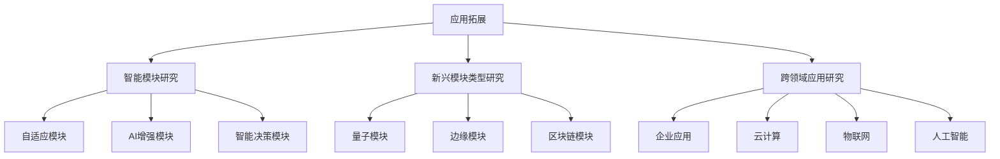

---

## 6. 理论合并分支递归展开

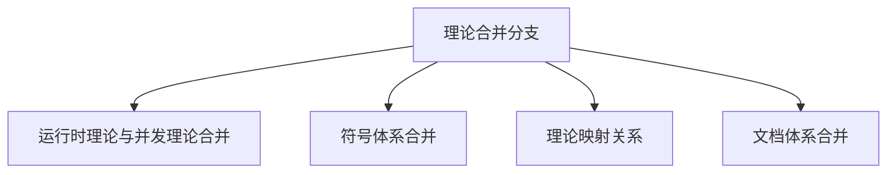

---

## 7. 进度与风险管理递归展开

```mermaid
graph TD
    PROG[进度与风险管理] --> SCHED[进度节点]
    SCHED --> USTS_P[USTS合并(95%)]
    SCHED --> UMS_P[UMS合并(60%)]
    SCHED --> TOOL_P[工具开发(65%)]
    SCHED --> DOC_P[文档完善(55%)]
    PROG --> RISK[风险节点]
    RISK --> THR[理论冲突风险]
    RISK --> CMP[复杂性风险]
    RISK --> DEL[进度风险]
    PROG --> CHAL[挑战与解决方案]
    CHAL --> DEF[术语冲突]
    CHAL --> FOR[表示差异]
    CHAL --> INT[交互语义差异]
    CHAL --> VER[验证方法整合]
```

---

## 8. 导航系统与索引递归集成

### 8.1 多层次导航与索引结构

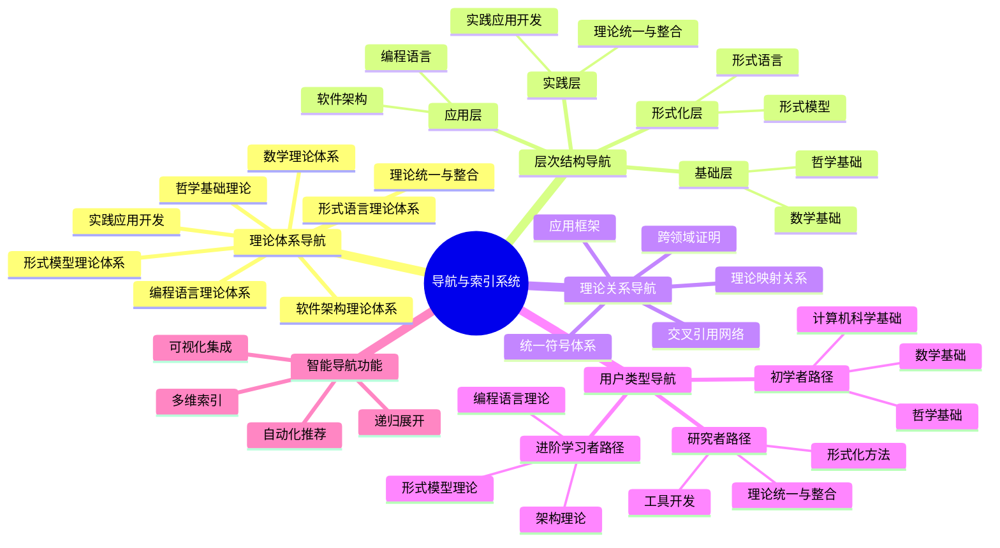

### 8.2 典型导航路径示例

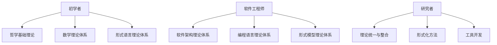

---

> 本分支递归集成了统一索引知识图谱系统的多层次导航、用户类型导航、交叉引用与自动化推荐等内容，便于知识图谱与导航系统的深度集成与可视化。

---

## 9. 跨领域与深层理论分支递归集成

### 9.1 结构化理论与范畴论

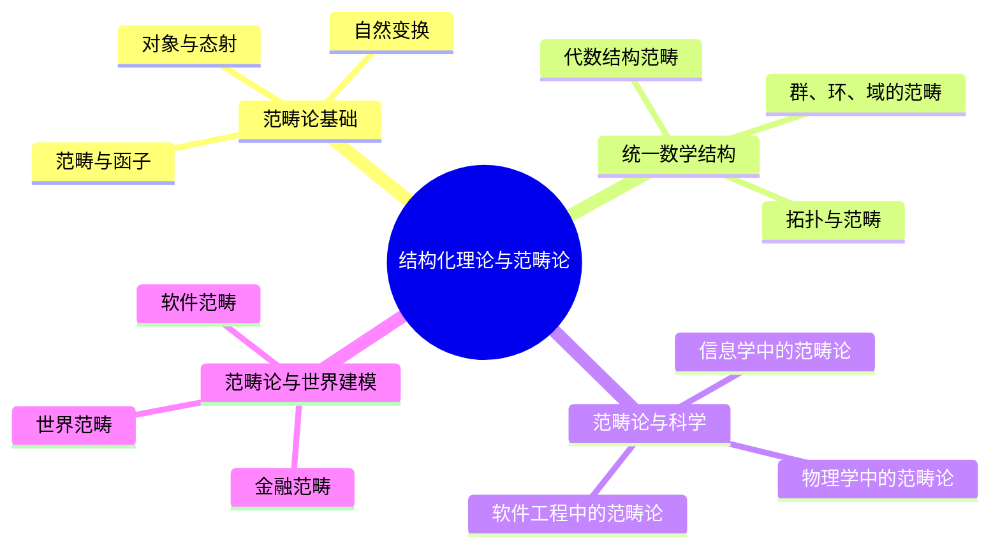

### 9.2 认知与智能理论

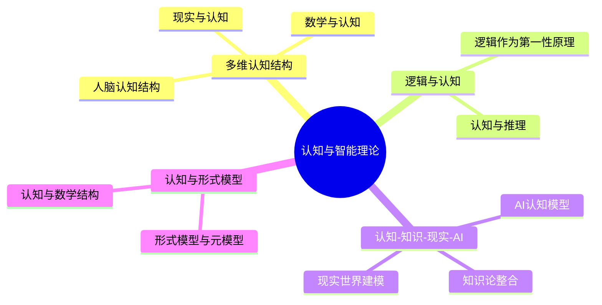

### 9.3 控制与系统理论

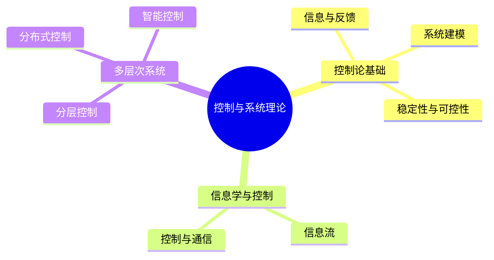

### 9.4 分布式与系统架构理论

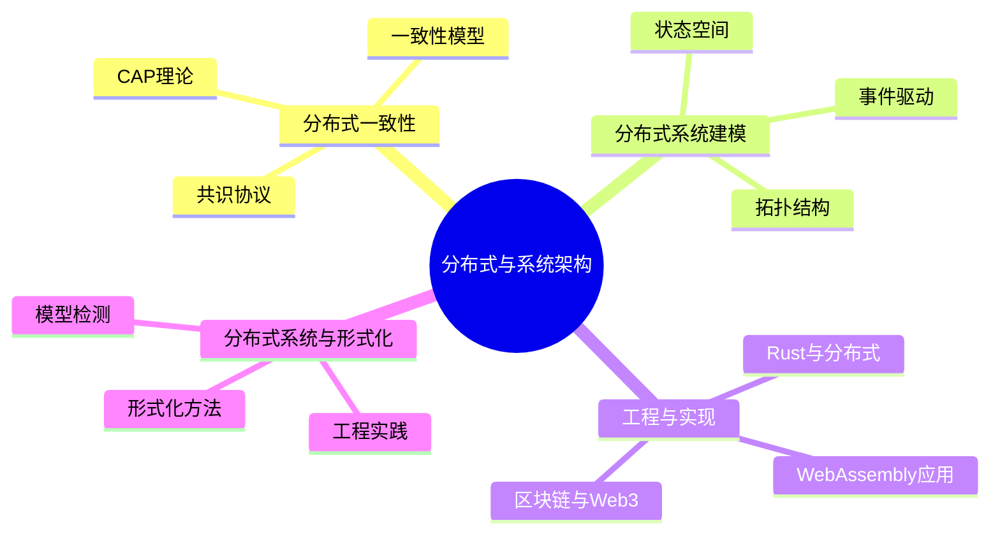

### 9.4.1 分布式系统设计与工程

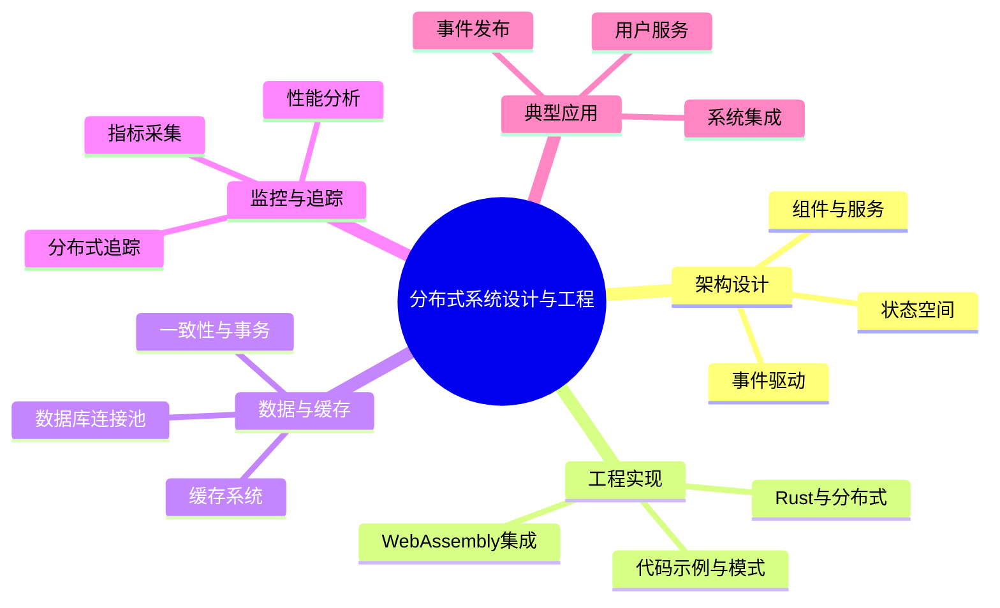

### 9.5 类型论与高阶结构（HoTT）

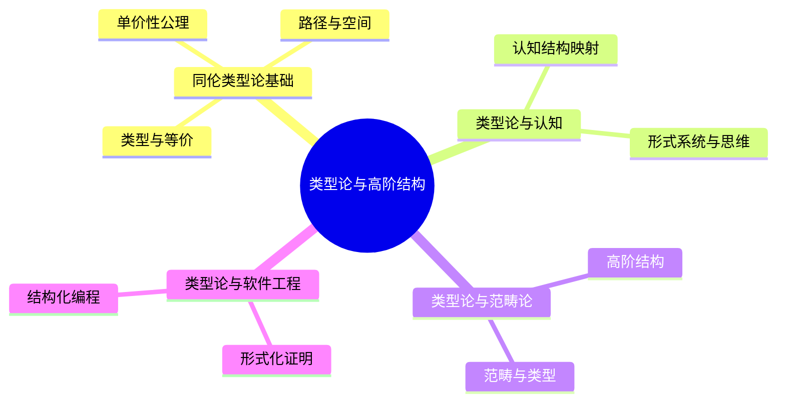

### 9.5.1 同伦类型论与软件工程

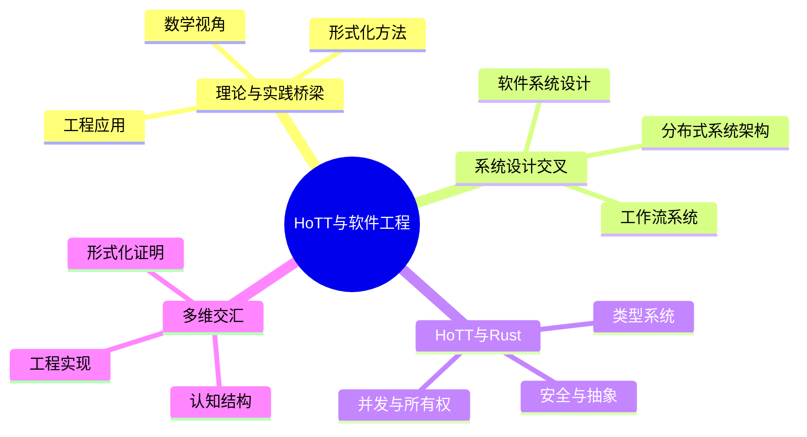

### 9.6 信息与知识理论

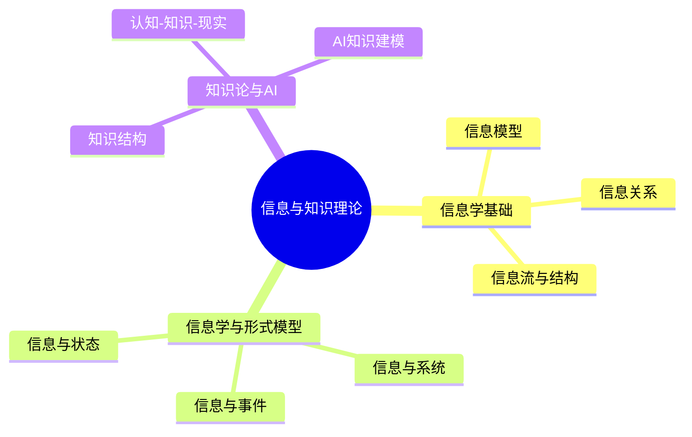

### 9.6.1 信息学与形式模型

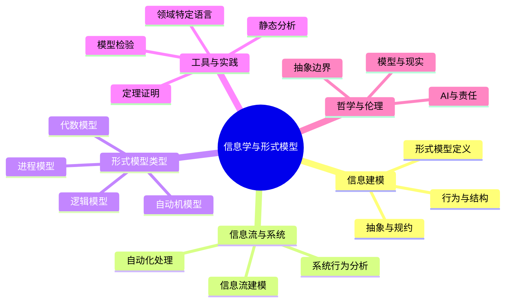

### 9.7 数学基础与分支

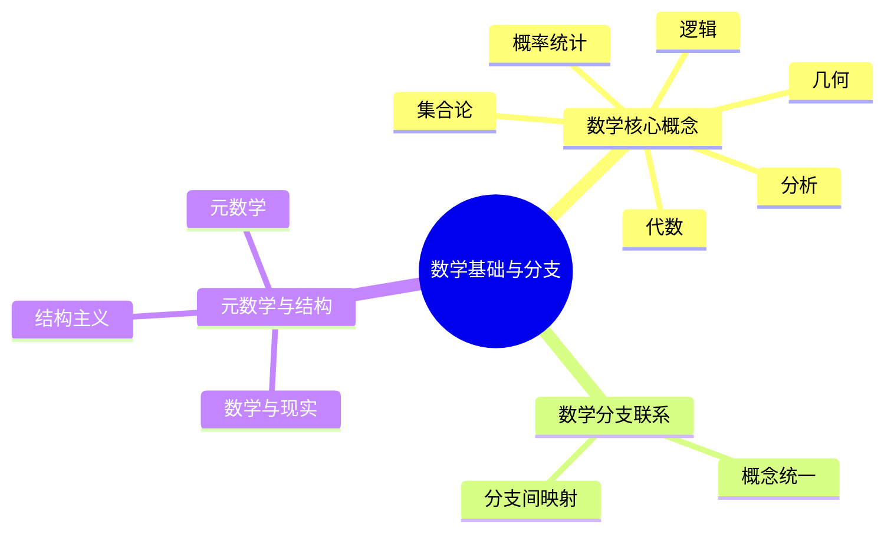

### 9.7.1 数学核心概念与元结构

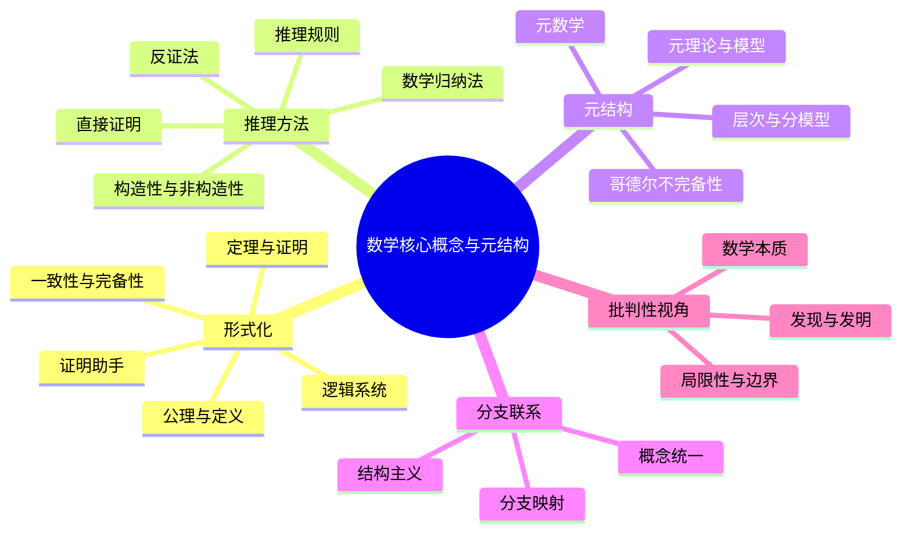

### 9.8 科学与跨学科理论

```mermaid
mindmap
  root((科学与跨学科理论))
    科学基础
      物理学
      化学
      生物学
    科学与哲学
      形式科学
      还原论
      哲学-科学-工程关联
    数学与科学
      数学-物理-科学映射
      形式化验证与推理
    跨学科整合
      工程实践
      社会科学
      形式科学与应用
```

### 9.9 多视角理论整合

```mermaid
mindmap
  root((多视角理论整合))
    形式-现实-认知
      现实建模
      认知映射
      数学结构
    形式-信息-系统
      信息流
      系统结构
      形式化方法
    形式-计算-数学
      计算模型
      数学基础
      形式化推理
    形式-语言-编程
      语言理论
      编程范式
      形式化语义
    形式科学核心概念
      概念关联
      结构映射
      应用整合
```

### 9.9.1 计算-形式-认知多视角整合

```mermaid
mindmap
  root((计算-形式-认知多视角整合))
    计算科学
      可计算性
      信息与算法
      计算模型
    形式科学
      类型论与范畴论
      形式语言与语义
      结构与转换
    认知科学
      认知计算模型
      智能的形式化
      表征与推理
    三域交叉
      同态映射
      统一模型
      关系与转换
    统一理论框架
      形式系统基础
      计算为转换
      认知为表征
      AI与复杂系统
```

### 9.1.1 范畴论与软件工程

```mermaid
mindmap
  root((范畴论与软件工程))
    软件形式结构
      结构-语义-演化
      软件宇宙与计算范式
      设计模式的范畴论模型
    软件架构与范畴论
      架构建模
      系统实现
      形式化证明
    范畴论与编程
      编程范式
      类型系统
      结构映射
```

### 9.1.2 范畴论与世界建模

```mermaid
mindmap
  root((范畴论与世界建模))
    认知与智能统一
      认知网络
      跨域映射
    学科桥梁
      软件-科学统一
      多界交汇
    世界范畴
      多维关联网络
      层次贯通
      不变性与连续性
```

### 9.1.3 范畴论与形式科学

```mermaid
mindmap
  root((范畴论与形式科学))
    结构到模式
      结构美学
      多维映射
    范畴透镜
      关系网络
      结构变革
    范畴论与科学
      物理学
      信息学
      形式科学交融
```

### 9.1.4 范畴论与数学

```mermaid
mindmap
  root((范畴论与数学))
    数学分支统一
      各分支结构
      整体观
    数学与现实
      本体论
      认识论
    三界映射
      数学-现实-认知
      结构网络
```

### 9.1.5 范畴论与控制

```mermaid
mindmap
  root((范畴论与控制))
    控制理论统一
      分布式系统
      微服务架构
    编程与系统架构
      控制与形式系统
      统一视角
    多维世界控制
      证明与推理
      层次控制
```

### 9.1.6 范畴论与AI

```mermaid
mindmap
  root((范畴论与AI))
    AI与多元世界
      认知自省
      递归自我改进
    AI与数学原理
      结构映射
      形式化探索
    AI的哲学基础
      认识论
      多学科交叉
```

### 9.8.1 科学与跨学科核心关联

```mermaid
mindmap
  root((科学与跨学科核心关联))
    数学
      抽象结构
      逻辑推理
      基础语言
    形式科学
      逻辑系统
      计算理论
      信息论
      系统论
      形式化方法
    自然科学
      物理学
      化学
      生物学
      层次结构
      还原与涌现
    社会科学
      社会学
      行为与结构
      定性与定量
      方法论挑战
    形式化方法
      规约与验证
      推理与证明
      模型检测
      定理证明
      局限与挑战
    元理论与元模型
      理论结构
      模型与元模型
      层次与反馈
    机制与解释
      实体与活动
      组织与系统
      解释力
    跨学科映射
      概念迁移
      工具共享
      方法论整合
```

### 9.9.2 信息-系统-结构多视角整合

```mermaid
mindmap
  root((信息-系统-结构多视角整合))
    元理论
      规范性与解释性
      启发性与统一性
      范畴论
      元模型理论
      知识表征理论
      形式语义学
    元模型
      结构元模型
      语义元模型
      动态元模型
      认知元模型
    元概念
      概念的元概念
      关系的元概念
      系统的元概念
      层次的元概念
      方法的元概念
    系统结构
      组件与交互
      层次与分层
      动态行为
      复杂系统
    层次映射
      理论-模型-数据链
      元模型-模型映射
      概念层次结构
    理论网络
      关系类型矩阵
      理论融合点
      网络分析
    批判性评价
      优缺点分析
      系统性问题
      统一框架展望
```

### 9.9.3 计算-形式-数学多视角整合

```mermaid
mindmap
  root((计算-形式-数学多视角整合))
    计算范式
      形式变换
      自动机与λ演算
      程序设计语言
      工作流与算法
    类型系统与逻辑
      类型-命题同构
      依赖类型
      证明即程序
    范畴论与程序
      对象与态射
      函子与单子
      结构映射
    抽象代数
      代数数据类型
      群与幺半群
      代数结构与递归
    拓扑与空间
      连续与离散
      同伦类型论
      空间计算模型
    信息流与优化
      信息度量
      梯度下降
      微分隐私
    线性代数与神经网络
      张量计算
      线性变换
      特征空间
    统一视角
      同构与等价
      计算即证明
      量子计算
```

### 9.9.4 语言-编程-系统多视角整合

```mermaid
mindmap
  root((语言-编程-系统多视角整合))
    可计算性理论
      图灵机
      λ演算
      递归函数
      不可计算问题
    程序设计语言
      类型系统
      操作语义
      表达能力
      抽象机制
    计算系统
      分布式计算
      并发模型
      状态转换
      资源管理
    工作流模型
      数据流
      控制流
      事件驱动
      响应式系统
    算法设计
      计算复杂性
      空间-时间权衡
      算法范式
      形式验证
    抽象模式
      设计模式
      架构模式
      计算范式
      形式化方法
    计算模型交互
      模型嵌入
      能力等级
      效率特性
      抽象程度
    形式系统映射
      语言编译
      模型模拟
      抽象与具体化
      同构与等价
    未来趋势
      量子计算
      神经符号系统
      范式融合
```

---

> 本分支递归集成了Model目录下所有核心理论分支，突出跨领域、深层结构与多视角整合，便于主知识图谱的自动化生成与可视化导航。

## 形式科学（Formal Science）

```mermaid
mindmap
  root((形式科学 Formal Science))
    核心基础
      逻辑学 Logic
        语法 Syntax
        语义 Semantics
        推理规则 Inference Rules
        证明 Proof
        可靠性 Soundness & 完备性 Completeness
        类型 命题/谓词/时序/模态等
        关联 形式化推理和验证的基石
      数学 Mathematics
        集合论/代数/图论等
        计算理论 Computability/Complexity
        关联 提供形式化语言和工具
    形式化方法 Formal Methods
      形式化规约 Formal Specification
        形式化语言 Z/VDM/B/TLA+/Alloy...
        属性类型 Safety/Liveness/Invariants
        关联 验证/推理的起点和标准
      形式化验证 Formal Verification
        模型检测 Model Checking
          机制 状态空间搜索/时序逻辑
          特点 自动化高/有限状态
          关联 自动化验证技术
        定理证明 Theorem Proving
          机制 逻辑公式/证明构造/证明辅助器
          特点 表达力强/通用性高/交互性强
          关联 基于形式化推理的验证技术
      形式化推理 Formal Reasoning
        逻辑演算
        推理步骤
        自动化推理 SAT/SMT/ATP
        关联 验证(定理证明)的核心引擎/逻辑应用
    元层次概念 Meta-Level Concepts
      元理论 Meta-theory vs 理论 Theory
        元数学 Metamathematics
        元逻辑 Metalogic
        关联 研究系统自身属性/反思和边界认知
      元模型 Meta-model vs 模型 Model
        UML元模型/规约语言规范
        关联 定义建模语言/提供框架和一致性
    层次、模型与关联性
      抽象层次 Abstraction Levels
        基础->语言/理论->建模->验证/推理->元层
        关联 依赖/抽象-具体化/反馈
      模型间关系 Model Relationships
        需求模型->规约模型->设计模型->实现模型
        精化/一致性检查/转换
        关联 精化是核心
      理论与实践 Theory vs Practice
        关联 形式化方法是桥梁/模型是载体/规约是转换/工具是实现
    与计算机科学的深度融合
      编程语言理论 PL Theory
        形式语义/类型系统/Lambda演算
        关联 规约/验证/类型系统可靠性
      算法与复杂性
        算法正确性/复杂性理论
        关联 验证工具设计/可行性
      人工智能 AI
        KRR/逻辑编程/规划/AI安全/可解释AI
        关联 可靠AI/自动推理
      数据库理论
        关系代数/范式理论/查询优化
        关联 数据管理基础
      密码学 Cryptography
        安全模型/协议验证/零知识证明
        关联 协议安全性
    形式化验证技术扩展与对比
      抽象解释 Abstract Interpretation
        机制 抽象域/转换器/收敛加速
        特点 自动化/可靠/不精确
      符号执行 Symbolic Execution
        机制 符号值/路径约束/SAT/SMT
        特点 路径探索/测试生成
      技术对比
        关联 技术互补/常结合使用
    关键支撑技术 SAT/SMT求解器
      SAT/SMT
        关联 多种形式化技术后端引擎
    核心思想与挑战
      抽象/组合性/理论局限性/工具化与易用性
    应用领域举例
      硬件/航空航天/铁路/医疗/操作系统/编译器/协议/金融
    哲学根基与认识论
      形式真理本质/数学哲学流派/形式化与理解
    认知科学视角
      人类推理vs形式逻辑/认知挑战
    领域特定形式化
      进程代数/CSP/CCS/π-演算
    形式化方法vs经验方法
      目标/能力对比/协同互补
    精化演算 Refinement Calculus
      规约->精化->代码
      关联 Hoare逻辑/程序综合
    历史脉络简述
      古希腊->逻辑/计算理论->程序逻辑->现代工具
    社会、伦理与认证
      标准/责任/偏见公平性
    最终总结
      核心价值/固有局限
    跨学科联系
      形式语言学/经济学与博弈论/系统生物学/理论物理
    形式化数学
      动机/著名项目/对数学实践影响
    范畴论 Category Theory
      核心概念/CS应用/元框架
    轻量级形式化方法
      增强类型/有限模型检查/契约式设计/静态分析
    教育与推广
      重要性/挑战/策略
    反思
      哥德尔/现实复杂性/规约来源/人类认知/未来
    具体建模形式 Petri网
      基本概念/特性分析/扩展与应用
    工具生态系统
      模型检测器/定理证明器/SMT求解器/静态分析/专用工具
    实践集成
      生命周期结合/工业模式/成功案例
    安全性分析
      协议验证/信息流安全/漏洞分析/硬件安全
    总结性反思
      深度/广度/关联性/张力
    AI/ML交汇
      验证挑战/技术探索/神经符号计算
    量子计算
      量子模型/程序逻辑/协议分析
    复杂性理论
      复杂度谱系/参数化复杂性/算法设计
    伦理与责任
      公平性困境/透明度/滥用风险
    形式化再思考
      过程/光谱/社会性/创造力
    最终视角
      交织的知识之网/结构/关联/演化
```

## 信息与系统（Information & Systems）

```mermaid
mindmap
  root((信息与系统 Information & Systems))
    形式化知识体系
      元理论-理论结构分析
        元理论本质与功能
        核心元理论剖析
        理论层次构成与特征
        元理论与理论间动态互动
      元模型-模型层次关系
        元模型角色与分类
        模型多样性与应用领域
        元模型指导下的模型构建与验证
      元概念-概念层次体系
        元概念：语法与语义
        概念多层次结构与特征
        概念体系的动态构建与创新
      形式化系统的分类架构
        表达能力维度下的系统分类
        结构特性维度下的系统分类
        分类架构的意义与理论选择
      层次间映射与转换机制
        不同层次间的核心映射关系
        关键转换机制与过程
        映射与转换的挑战与保障机制
      理论关系网络分析
        关系类型矩阵
        融合点与转换核心
        理论融合的驱动力与模式
      批判性综合评价
        理论体系优缺点分析
        结构化知识的系统性问题与对策
        统一框架的可能性与路径分析
        未来研究方向与开放挑战
      思维导图（深度修订版）
    信息论
      基础与历史
        信息论创立背景
        信息论核心突破
        信息论的哲学意义
      信息的本体论与多维定义
        信息概念的多重定义
        信息的本体论地位
        信息分层模型与类型学
      信息论的形式化体系与基本定理
        信息熵的形式化定义与性质
        信道容量定理及其证明
        其他关键定理
      信息论的分支演化与跨领域扩展
        经典信息论主要分支
        跨学科扩展与新兴方向
        应用驱动的理论拓展
      信息论与其他理论的映射关系
        与热力学的深层关联
        与计算理论的映射
        与统计学习理论
        与复杂系统理论
      元模型-模型框架下的信息论
        元模型视角下的信息论
        信息论中的同构与同态映射
        跨域建模中的信息论框架
      信息论对认知的解释与界限
        信息处理视角下的人脑认知
        信息论解释的形式化证明
        人脑认知超越信息论的维度
      认知论视角下的信息概念批判
        信息与知识的认知论区分
        信息的建构论与实在论之争
        信息、表征与真理
      信息论范式的局限性分析
        信息论的内在局限
        复杂系统中的应用困境
        走向整合性信息理论的路径
      未来展望
        信息、意义与语境的整合框架
        跨学科信息学方法论
        信息本体论的重构设想
      思维导图
    信息-数据-知识关系
      概念框架与基础定义
        信息的多重定义
        数据与知识的界定
        关系的初步模型
      理论基础与局限
        香农信息论的核心洞见
        信息论的认知论局限
        超越香农：替代性信息理论
      数据-信息-知识-智慧层级模型批判
        DIKW金字塔模型及其影响
        线性层级模型的深层问题
        网络动态模型的替代方案
      信息熵与知识的不确定性
        熵的认知论意义
        复杂系统中的信息与知识
        熵与知识边界
      信息处理与认知机制对比
        计算信息处理与人脑认知差异
        嵌入性与具身性认知
        直觉、创造性与隐性知识
      信息语境性与知识建构
        信息的语境依赖性
        社会知识建构论
        专业知识与实践智慧
      大数据时代的认知论转向
        数据驱动知识的兴起
        数据驱动范式的认知论挑战
        人工智能与知识生产
      信息、意义与理解的鸿沟
        信息与意义的区分
        诠释学循环与理解过程
        意义的社会建构
      跨学科整合：走向信息认知论
        信息认知论的核心原则
        认知行为的重新概念化
        知识生态学视角
        数字时代的认知转型
        知识民主化与新知识鸿沟
        整合框架的应用前景
      结论与前瞻
        核心张力的持续存在
        未来研究方向
        实践建议与哲学反思
      思维导图
```
