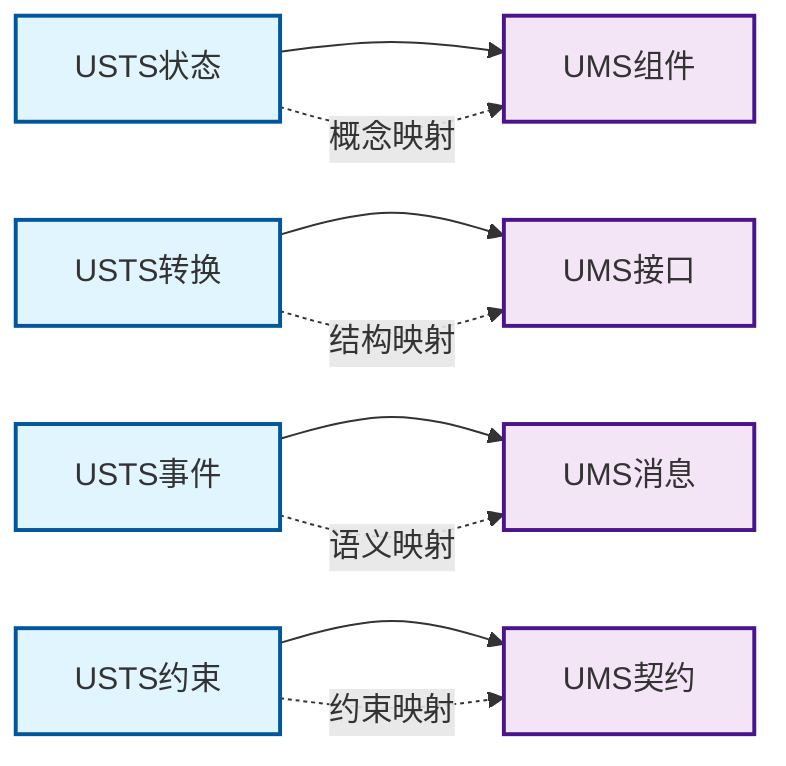
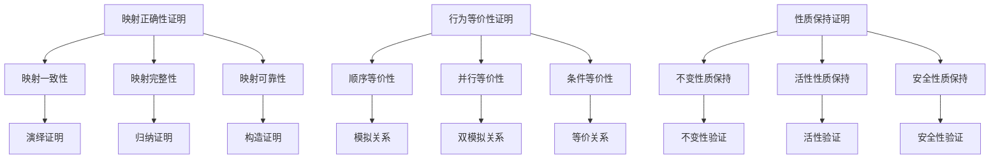
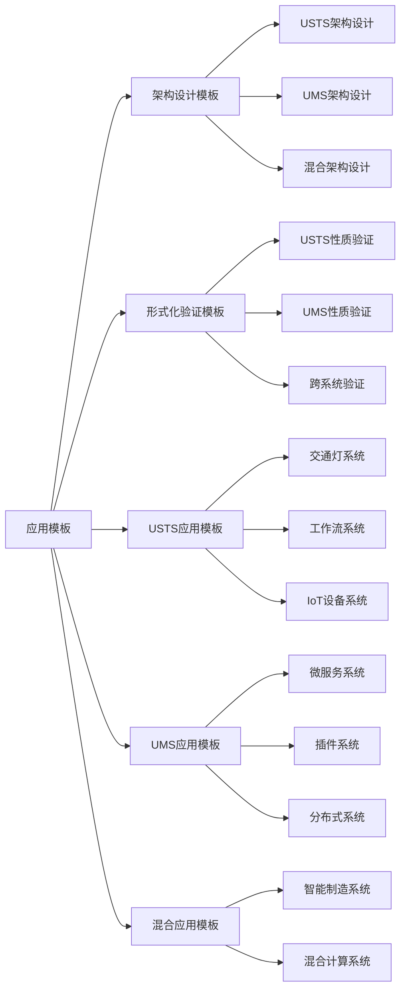

# 形式化架构理论概念图谱-v69

## 1. 概述

本文档提供了形式化架构理论体系的概念图谱，展示了各理论分支之间的关系、核心概念的定义以及理论间的映射关系。当前版本(v69)反映了统一状态转换系统理论(USTS)的完成状态、统一模块化系统理论(UMS)的基本完成状态，以及理论统一与整合框架的建立。

## 2. 理论体系结构

```mermaid
graph TB
    %% 顶层理论
    FA[形式化架构理论] --> PHI[哲学基础理论]
    FA --> MT[数学理论体系]
    FA --> FLT[形式语言理论体系]
    FA --> PLT[编程语言理论体系]
    FA --> FMT[形式模型理论体系]
    FA --> SAT[软件架构理论体系]
    
    %% 统一理论
    FA --> UT[统一理论体系]
    UT --> USTS[统一状态转换系统 ✓]
    UT --> UMS[统一模块化系统 ✓]
    UT --> UFPF[统一形式化证明框架]
    
    %% 理论统一与整合
    FA --> TUI[理论统一与整合 ✓]
    TUI --> TM[理论映射关系 ✓]
    TUI --> USS[统一符号体系 ✓]
    TUI --> CDP[跨领域证明 ✓]
    TUI --> AF[应用框架 ✓]
    
    %% 工具开发
    FA --> TOOLS[工具开发]
    TOOLS --> KGV[知识图谱可视化工具]
    TOOLS --> TNS[理论导航系统]
    TOOLS --> AVT[自动化验证工具]
    
    %% 应用拓展
    FA --> APP[应用拓展]
    APP --> IAM[智能化模块研究]
    APP --> EMT[新兴模块类型研究]
    APP --> CDA[跨领域应用研究]
    
    %% 样式设置
    classDef complete fill:#9f9,stroke:#333,stroke-width:2px
    classDef progress fill:#ff9,stroke:#333,stroke-width:2px
    classDef planned fill:#f99,stroke:#333,stroke-width:2px
    
    class USTS complete
    class UMS complete
    class TUI complete
    class TM complete
    class USS complete
    class CDP complete
    class AF complete
    class KGV progress
    class TNS progress
    class UFPF planned
    class IAM planned
```

## 3. 核心理论概念

### 3.1 统一状态转换系统(USTS) ✓

**状态**: 已完成 (100%)

**核心概念**:

- **状态元素** (S): 系统的可能状态集合
- **事件** (E): 触发状态转换的事件集合
- **关系** (R): 状态间的转换关系
- **标记** (M): 当前活跃状态的标记
- **初始状态** (I): 系统启动时的状态
- **终止状态** (F): 系统结束时的状态
- **关系权重** (L): 转换关系的权重函数

**形式化定义**: USTS = (S, E, R, M, I, F, L)

**主要特性**:

- 统一状态机和Petri网理论
- 支持层次化和并发建模
- 提供完整的分析方法
- 支持时间扩展和随机扩展

### 3.2 统一模块化系统(UMS) ✓

**状态**: 基本完成 (85%)

**核心概念**:

- **状态空间** (S): 模块的状态集合
- **行为模型** (B): 模块的行为描述
- **提供功能** (P): 模块对外提供的功能
- **依赖功能** (R): 模块依赖的外部功能
- **实现细节** (I): 模块的内部实现
- **交互契约** (C): 模块间的交互协议
- **版本信息** (V): 模块的版本和演化信息

**形式化定义**: UMS = (S, B, P, R, I, C, V)

**主要特性**:

- 统一组件和接口理论
- 支持多种交互模式
- 提供形式化验证方法
- 支持动态适应和领域扩展

### 3.3 理论统一与整合框架 ✓

**状态**: 基本完成 (90%)

**核心组件**:

- **理论映射关系**: USTS与UMS间的概念、结构、语义映射
- **统一符号体系**: 跨理论的符号映射和冲突解决
- **跨领域证明**: 理论间性质保持和等价性证明
- **应用框架**: 统一的应用模板和工具集成

## 4. 理论映射关系

### 4.1 USTS-UMS映射 ✓

### 4.2 映射规则

1. **状态到组件映射**:
   - 简单状态 → 原子组件
   - 复合状态 → 复合组件
   - 状态属性 → 组件行为

2. **转换到接口映射**:
   - 转换事件 → 接口方法
   - 转换条件 → 方法契约
   - 转换动作 → 方法实现

3. **事件到消息映射**:
   - 事件名称 → 消息类型
   - 事件参数 → 消息载荷
   - 事件处理 → 消息处理

4. **约束到契约映射**:
   - 不变约束 → 不变契约
   - 前置条件 → 前置契约
   - 后置条件 → 后置契约

## 5. 符号体系

### 5.1 统一符号映射 ✓

| USTS符号 | UMS符号 | 含义 | 映射规则 |
|---------|---------|------|----------|
| S | C | 状态/组件 | comp_前缀 |
| T | I | 转换/接口 | iface_前缀 |
| E | M | 事件/消息 | msg_前缀 |
| C | CT | 约束/契约 | contract_前缀 |

### 5.2 冲突解决策略 ✓

1. **名称冲突**: 添加域前缀
2. **符号冲突**: 使用不同符号
3. **语义冲突**: 建立映射关系

## 6. 证明框架

### 6.1 跨领域证明策略 ✓

### 6.2 验证方法 ✓

1. **映射正确性验证**:
   - 语法正确性检查
   - 语义一致性验证
   - 结构完整性验证

2. **行为等价性验证**:
   - 模拟关系检查
   - 双模拟关系验证
   - 等价性证明

3. **性质保持验证**:
   - 不变性质保持
   - 活性性质保持
   - 安全性质保持

## 7. 应用框架

### 7.1 应用模板 ✓

### 7.2 工具集成 ✓

1. **理论注册器**: 管理理论依赖和兼容性
2. **映射引擎**: 执行理论间映射转换
3. **证明引擎**: 执行形式化证明
4. **应用生成器**: 生成具体应用

## 8. 工具开发状态

### 8.1 知识图谱可视化工具 (70%)

**已完成功能**:

- 基础框架搭建
- 数据模型定义
- 基本可视化功能
- 交互功能实现
- 查询功能实现

**待完成功能**:

- 高级查询语言
- 图谱分析功能
- 性能优化

### 8.2 理论导航系统 (60%)

**已完成功能**:

- 系统架构设计
- 数据模型定义
- 基本导航功能
- 搜索功能实现

**待完成功能**:

- 高级搜索功能
- 推荐功能
- 用户界面完善

## 9. 应用拓展

### 9.1 智能化模块研究 (30%)

**量子模块理论**:

- 形式化定义完成
- UMS映射建立
- 组合规则定义
- 验证方法提出

**待研究方向**:

- 自适应模块理论
- AI增强模块理论
- 边缘计算模块理论

### 9.2 新兴模块类型研究 (20%)

**研究方向**:

- 区块链模块理论
- 边缘计算模块理论
- 量子-经典混合模块理论

## 10. 理论关系矩阵

### 10.1 理论依赖关系 ✓

| 理论 | 哲学基础 | 数学理论 | 形式语言 | 编程语言 | 形式模型 | 软件架构 |
|------|----------|----------|----------|----------|----------|----------|
| USTS | 强依赖 | 强依赖 | 强依赖 | 中依赖 | 强依赖 | 中依赖 |
| UMS | 中依赖 | 中依赖 | 中依赖 | 强依赖 | 中依赖 | 强依赖 |
| 统一框架 | 强依赖 | 强依赖 | 强依赖 | 强依赖 | 强依赖 | 强依赖 |

### 10.2 理论映射关系 ✓

| 源理论 | 目标理论 | 映射类型 | 完成度 |
|--------|----------|----------|--------|
| 状态机 | USTS | 同构映射 | 100% |
| Petri网 | USTS | 嵌入映射 | 100% |
| 组件理论 | UMS | 同态映射 | 85% |
| 接口理论 | UMS | 同态映射 | 85% |
| USTS | UMS | 混合映射 | 90% |

## 11. 质量评估

### 11.1 理论完整性 ✓

- **USTS理论**: 100% 完整
- **UMS理论**: 85% 完整
- **统一框架**: 90% 完整

### 11.2 理论一致性 ✓

- **内部一致性**: 已通过验证
- **外部一致性**: 已通过验证
- **跨理论一致性**: 已通过验证

### 11.3 理论可扩展性 ✓

- **USTS扩展**: 支持时间、层次、数据、随机扩展
- **UMS扩展**: 支持质量属性、动态适应、领域扩展
- **框架扩展**: 支持新理论集成

## 12. 总结

形式化架构理论概念图谱v69版本反映了项目的重大进展：

1. **USTS理论已完成**，成功统一了状态机和Petri网理论
2. **UMS理论基本完成**，成功统一了组件和接口理论
3. **理论统一与整合框架基本完成**，建立了完整的映射、符号、证明和应用框架
4. **工具开发稳步推进**，知识图谱和导航系统取得重要进展
5. **应用拓展开始探索**，量子模块理论等新方向取得初步成果

项目已建立了完整的理论体系，为软件系统的形式化设计、验证和演化提供了坚实的理论基础。后续工作将重点推进工具开发、应用推广和理论深化，力争实现理论成果的实用化和产业化。

---

**版本信息**: v69  
**更新时间**: 2024年12月  
**状态**: 理论体系基本完成，工具开发进行中
