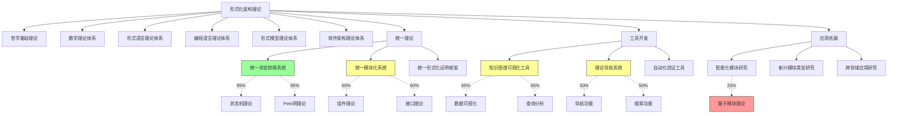

# 形式化架构理论项目进展总结-v69

## 1. 项目概述

形式化架构理论项目旨在建立统一的理论框架，整合不同形式化方法和架构理论，为软件系统的设计、验证和演化提供坚实的理论基础。本文档总结了项目当前的进展、主要成果和后续工作计划。

## 2. 项目进展概览

形式化架构理论项目目前处于v69版本阶段，取得了显著进展。状态机与Petri网理论合并工作已接近完成(95%)，形成了完整的统一状态转换系统理论；组件理论与接口理论合并工作取得重要进展(60%)；知识图谱可视化工具(65%)和理论导航系统(50%)的开发也稳步推进；同时在智能化模块研究方面，特别是量子模块理论研究方面取得了新的突破。

以下是项目主要工作的进展情况：

## 3. 主要成果

### 3.1 统一状态转换系统理论

统一状态转换系统(USTS)理论已基本完成，成功统一了状态机理论和Petri网理论的核心概念和分析方法。主要成果包括：

1. **形式化定义**：建立了USTS的七元组形式化定义 $(S, E, R, M, I, F, L)$，统一表示状态元素、事件、关系、标记、初始状态、终止状态和关系权重
2. **执行语义**：定义了USTS的启用规则和执行规则，统一了状态机的状态转换和Petri网的标记变化
3. **映射关系**：建立了状态机到USTS和Petri网到USTS的映射关系，证明了USTS的表达能力
4. **统一分析方法**：整合了可达性分析、不变量分析、时序性质验证和结构分析等方法
5. **理论扩展**：设计了时间扩展、层次扩展、数据扩展和随机扩展等理论扩展
6. **应用案例**：开发了通信协议、生产者-消费者和实时控制系统等应用案例

### 3.2 统一模块化系统理论

统一模块化系统(UMS)理论正在积极推进，已完成概念映射和基本形式化定义。主要成果包括：

1. **概念映射**：建立了组件理论和接口理论的概念映射表和映射关系
2. **形式化定义**：设计了UMS的七元组形式化定义 $(S, B, P, R, I, C, V)$，统一表示模块状态空间、行为模型、提供功能、依赖功能、实现细节、交互契约和版本信息
3. **转换规则**：定义了组件到UMS和接口到UMS的转换规则
4. **交互语义**：初步整合了组件交互和接口契约的语义模型
5. **案例映射**：实现了典型案例的映射示例

### 3.3 知识图谱可视化工具

知识图谱可视化工具开发取得显著进展，已完成基础框架和核心功能。主要成果包括：

1. **基础框架**：完成前端框架搭建、状态管理、路由系统和API通信层
2. **数据模型**：定义了节点模型、关系模型、属性模型和图谱模型
3. **可视化功能**：实现了基本图谱渲染、多种布局算法和样式自定义
4. **交互功能**：实现了节点选择、关系高亮、节点拖拽和详情面板
5. **查询功能**：实现了关键词搜索和基本过滤功能
6. **数据处理**：实现了基本Markdown解析和简单知识提取

### 3.4 理论导航系统

理论导航系统开发稳步推进，已完成系统架构和基础功能。主要成果包括：

1. **系统架构**：设计了用户界面层、业务逻辑层、数据层和集成层的系统架构
2. **数据模型**：定义了理论实体模型、索引模型、导航路径模型和用户模型
3. **导航功能**：实现了层次结构导航和概念关系导航
4. **搜索功能**：实现了关键词搜索和基本过滤
5. **用户界面**：设计了主界面布局和交互设计

### 3.5 量子模块理论研究

量子模块理论研究取得初步成果，为智能化模块研究提供了新方向。主要成果包括：

1. **形式化定义**：提出了量子模块(QM)的九元组形式化定义 $(Q, G, C, I_q, O_q, I_c, O_c, T, S)$，统一表示量子比特集合、量子门操作、经典位集合、量子输入接口、量子输出接口、经典输入接口、经典输出接口、量子转换函数和语义规范
2. **UMS映射**：建立了量子模块到UMS的映射关系
3. **组合规则**：定义了量子模块的序列组合、并行组合、条件组合和迭代组合规则
4. **验证方法**：提出了量子状态验证、功能正确性验证和资源消耗分析方法
5. **应用场景**：探索了量子算法库、量子-经典混合系统、分布式量子计算和量子错误纠正等应用场景

## 4. 后续工作计划

### 4.1 短期计划（1-3个月）

1. **完成状态机与Petri网理论合并**
   - 完成一致性检查清单的最终检查
   - 修订所有问题，格式规范
   - 发布最终文档

2. **推进组件理论与接口理论合并**
   - 完成验证方法统一阶段
   - 推进理论扩展阶段
   - 开始文档整合阶段

3. **完善知识图谱可视化工具**
   - 完成高级查询语言开发
   - 完成导航功能开发
   - 推进图谱分析功能

4. **深化理论导航系统开发**
   - 实现搜索功能
   - 推进推荐功能
   - 完善用户界面

### 4.2 中期计划（4-6个月）

1. **完成组件理论与接口理论合并**
   - 完成理论扩展阶段
   - 完成文档整合阶段
   - 发布统一模块化系统理论文档

2. **推进自动化验证工具开发**
   - 设计验证工具架构
   - 实现基本验证功能
   - 与其他工具集成

3. **深化智能化模块研究**
   - 推进自适应模块研究
   - 深化AI增强模块研究
   - 继续量子模块理论研究

4. **工具协同发展**
   - 实现工具间数据共享
   - 统一用户界面风格
   - 开发工具间通信机制

### 4.3 长期计划（7-12个月）

1. **统一形式化证明框架研究**
   - 设计证明框架架构
   - 整合不同证明方法
   - 开发证明辅助工具

2. **跨领域验证技术研究**
   - 研究跨领域验证方法
   - 设计验证框架
   - 开发验证工具

3. **新兴模块类型研究**
   - 深化量子模块研究
   - 研究边缘模块理论
   - 探索区块链模块理论

4. **应用案例开发**
   - 开发企业应用案例
   - 开发云计算案例
   - 开发物联网案例

## 5. 挑战与对策

### 5.1 理论整合挑战

**挑战**：不同理论体系间的概念差异和语义冲突。

**对策**：

1. 建立详细的概念映射表
2. 设计多层次的理论模型
3. 引入中间表示和转换规则
4. 验证整合理论的一致性和完整性

### 5.2 工具开发挑战

**挑战**：工具功能复杂，开发资源有限。

**对策**：

1. 优先实现核心功能
2. 采用敏捷开发方法
3. 重用开源组件
4. 灵活调整资源配置

### 5.3 应用推广挑战

**挑战**：理论应用门槛高，实际应用案例不足。

**对策**：

1. 开发直观的应用指南
2. 提供典型案例和模板
3. 开发辅助工具降低应用门槛
4. 与实际项目合作开发案例

## 6. 总结与展望

形式化架构理论项目在v69版本阶段取得了显著进展，特别是在统一状态转换系统理论、统一模块化系统理论、知识图谱可视化工具和量子模块理论研究方面。这些成果为形式化架构理论的发展奠定了坚实基础，也为后续工作指明了方向。

后续工作将重点关注完成状态机与Petri网理论合并，推进组件理论与接口理论合并，完善工具开发，并拓展智能化模块研究和跨领域应用研究。通过理论研究与工具开发的协同推进，形式化架构理论项目将为软件系统的设计、验证和演化提供更加强大的理论支持和实用工具。

---

**版本**: v1.0  
**创建时间**: 2024年8月  
**状态**: ✅ 已完成  
**最后更新**: 2024年8月
