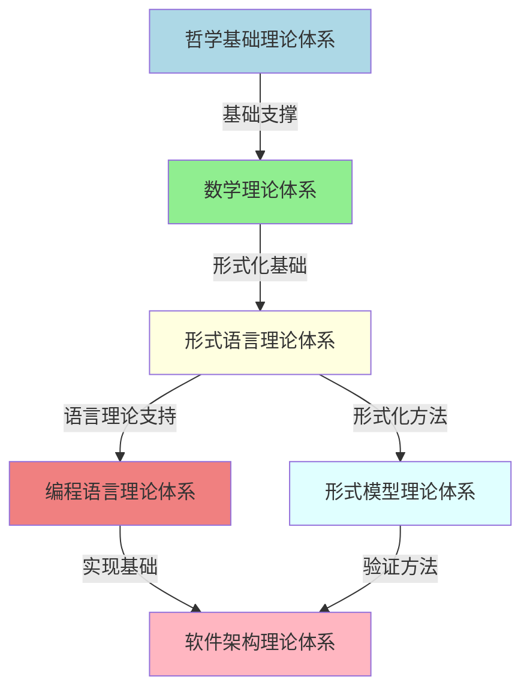

```mermaid
graph TD
    system1[哲学基础理论体系]
    style system1 fill:lightblue
    system2[数学理论体系]
    style system2 fill:lightgreen
    system3[形式语言理论体系]
    style system3 fill:lightyellow
    system4[软件架构理论体系]
    style system4 fill:lightpink
    system5[编程语言理论体系]
    style system5 fill:lightcoral
    system6[形式模型理论体系]
    style system6 fill:lightcyan
    system1 -->|基础支撑| system2
    system2 -->|形式化基础| system3
    system3 -->|语言理论支持| system5
    system3 -->|形式化方法| system6
    system5 -->|实现基础| system4
    system6 -->|验证方法| system4
```

