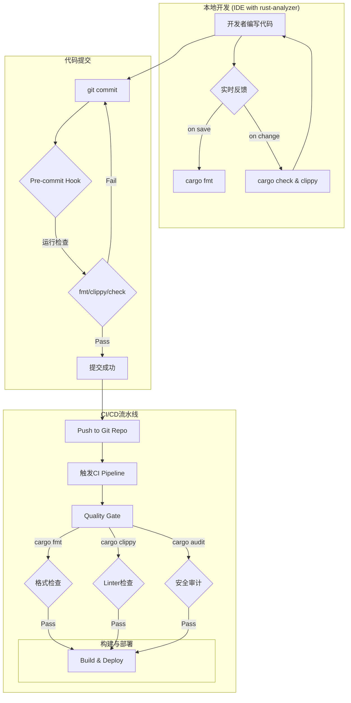

# 1.3 Rust代码质量与静态分析

## 目录

- [1.3 Rust代码质量与静态分析](#13-rust代码质量与静态分析)
  - [目录](#目录)
  - [1. 引言与定义](#1-引言与定义)
  - [2. Cargo内置工具](#2-cargo内置工具)
    - [2.1 `cargo fmt`](#21-cargo-fmt)
    - [2.2 `cargo check`](#22-cargo-check)
    - [2.3 `cargo clippy`](#23-cargo-clippy)
  - [3. 核心静态分析实践](#3-核心静态分析实践)
    - [3.1 `deny(warnings)`](#31-denywarnings)
    - [3.2 Rust-analyzer](#32-rust-analyzer)
    - [3.3 依赖安全审计: `cargo audit`](#33-依赖安全审计-cargo-audit)
  - [4. 自动化集成与实践](#4-自动化集成与实践)
    - [4.1 VSCode集成](#41-vscode集成)
    - [4.2 Git Pre-commit Hooks](#42-git-pre-commit-hooks)
    - [4.3 CI/CD流水线集成](#43-cicd流水线集成)
  - [5. 配置示例](#5-配置示例)
    - [5.1 `clippy.toml` 配置文件](#51-clippytoml-配置文件)
    - [5.2 GitHub Actions工作流中的质量检查](#52-github-actions工作流中的质量检查)
  - [6. 行业应用案例](#6-行业应用案例)
  - [7. Mermaid图表：Rust代码质量保障流程](#7-mermaid图表rust代码质量保障流程)
  - [8. 参考文献](#8-参考文献)

---

## 1. 引言与定义

**代码质量**在Rust中具有特殊的重要性，因为它直接关系到语言的核心承诺：**内存安全**和**线程安全**。Rust的编译器本身就是第一道，也是最强的静态分析防线。**静态分析**工具链则在此基础上，进一步检查代码的风格、逻辑、潜在bug和安全漏洞，是构建健壮可靠软件的关键。

## 2. Cargo内置工具

Cargo集成了一流的工具来维护代码质量。

### 2.1 `cargo fmt`

`cargo fmt`是官方的代码格式化工具。它根据一套社区公认的风格指南自动格式化代码，确保了整个Rust生态系统代码风格的高度一致性，使开发者能专注于逻辑而非格式。

### 2.2 `cargo check`

`cargo check`快速分析代码并报告任何错误和警告，但不执行耗时的编译后端阶段。它是在开发过程中获取快速反馈的理想选择。

### 2.3 `cargo clippy`

**Clippy**是Rust的官方Linter。它提供了超过450条Lint规则，能够捕捉到各种各样从代码风格到潜在逻辑错误的issue。Clippy的建议通常都非常有价值，是提升代码质量和学习Rust惯用法的绝佳工具。

## 3. 核心静态分析实践

### 3.1 `deny(warnings)`

一个严格的最佳实践是在CI环境或发布前，将所有编译器警告（warnings）视为错误。这可以通过在代码中加入`#![deny(warnings)]`属性或在构建命令中加入`RUSTFLAGS="-D warnings"`来实现。这能强制开发者解决所有潜在问题，不留技术债务。

### 3.2 Rust-analyzer

**Rust-analyzer** ([https://rust-analyzer.github.io/](https://rust-analyzer.github.io/)) 是为IDE（如VSCode, IntelliJ）提供支持的语言服务器（Language Server）。它在后台持续运行`cargo check`等工具，为开发者提供实时的错误提示、代码补全、类型信息和重构能力，是现代Rust开发不可或缺的一部分。

### 3.3 依赖安全审计: `cargo audit`

软件的安全不仅取决于你自己的代码，还取决于你的依赖。**`cargo-audit`** ([https://github.com/RustSec/cargo-audit](https://github.com/RustSec/cargo-audit)) 是一个用于检查`Cargo.lock`文件，并根据Rust安全公告数据库报告项目中是否存在已知安全漏洞的crate的工具。

## 4. 自动化集成与实践

### 4.1 VSCode集成

通过安装[rust-analyzer](https://marketplace.visualstudio.com/items?itemName=rust-lang.rust-analyzer)插件，可以在保存文件时自动运行`cargo fmt`进行格式化，并获得由rust-analyzer提供的实时诊断和Clippy建议。

### 4.2 Git Pre-commit Hooks

与Go类似，可以在`pre-commit`钩子中设置`cargo fmt -- --check`（检查格式是否正确）、`cargo check`和`cargo clippy`。这能确保提交到代码库的所有代码都符合格式和质量标准。

### 4.3 CI/CD流水线集成

在CI流水线中，应包含一个专门的"质量检查"阶段，该阶段至少执行以下命令：

1. `cargo fmt -- --check`
2. `cargo clippy -- -D warnings` (将Clippy的所有警告视为错误)
3. `cargo audit`

任何一个命令失败都应立即中止流水线。

## 5. 配置示例

### 5.1 `clippy.toml` 配置文件

在项目根目录创建`clippy.toml`可以自定义Clippy的行为。

```toml
# clippy.toml

# 将某些警告的级别提升为错误
deny = ["unwrap_used", "expect_used"]

# 允许某些在测试代码中无所谓的lints
allow-in-tests = ["unwrap_used", "expect_used"]
```

### 5.2 GitHub Actions工作流中的质量检查

```yaml
- name: Check formatting
  run: cargo fmt -- --check

- name: Run Clippy
  run: cargo clippy -- -D warnings

- name: Security audit
  run: cargo audit
```

## 6. 行业应用案例

- **所有专业的Rust项目**: 几乎所有知名的开源Rust项目（如`ripgrep`, `tikv`, `hyper`）都在其CI流程中强制执行`cargo fmt`和`cargo clippy`。这种文化使得Rust生态的代码质量普遍非常高。
- **Google Fuchsia OS**: 在其操作系统组件的开发中，Google强制要求所有Rust代码通过Clippy的检查，并将其作为代码提交的门禁（presubmit check）之一。

## 7. Mermaid图表：Rust代码质量保障流程



## 8. 参考文献

- [`cargo clippy` Documentation](https://doc.rust-lang.org/stable/clippy/)
- [`cargo fmt` Documentation](https://github.com/rust-lang/rustfmt)
- [`rust-analyzer` Manual](https://rust-analyzer.github.io/manual.html)
- [RustSec Advisory Database](https://rustsec.org/)
